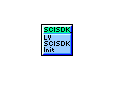
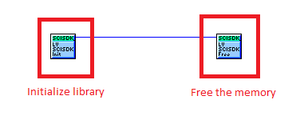
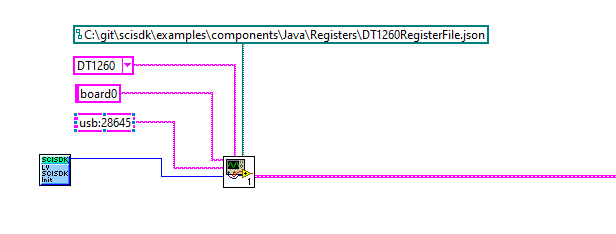
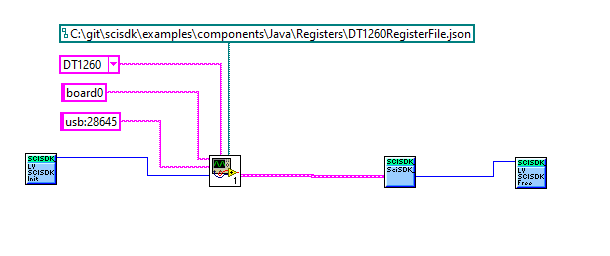
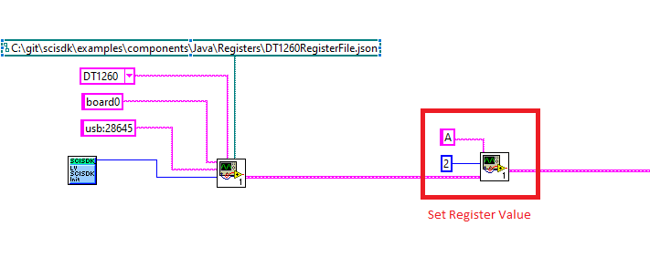
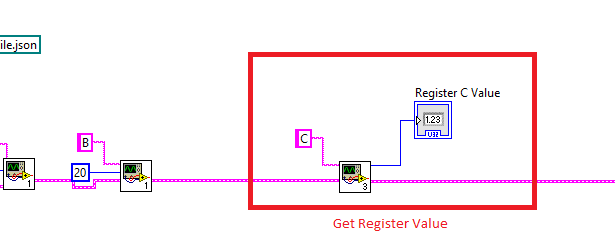
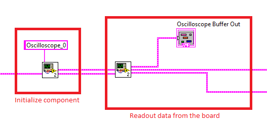

#  SciSDK Library Introduction 
<b> The Software Development kit for SciCompiler User Firmware </b>

## 1. Introduction
The SciSDK is a cross-platform library to write custom control and readout software for SciCompiler generated user firmware.

SciCompiler is a Nuclear Instruments (http://www.nuclearinstruments.eu) tool to generate FPGA firmware con NI/Caen OpenHardware FPGA (https://www.caen.it/families/open-fpga-digitizers/)

The SciCompiler convert a block diagram description of the user firmware is a hardware compatible bitstream managing also the readout of the data from the hardware. This library is intended to be used to write the control and readout software for the user firmware and works only with firmware generated by SciCompiler.

Several processing block of SciCompiler does not require any software support. Typically they are the algorithm processing blocks.
Other components require to be configured. For example the trigger requires a configurable threshold to adopt the trigger level to the signal, indeed software configurable parameters are required.
Other elemets in the diagram, like lists, oscilloscopes, digitizers, histograms produce as output a stream of value rappresenting the result of the measurament indeed they require to be readout.

Scicompiler implements for every readout/processing board a custom I/O bus (readout bus) to set paramenters and perform readout of the data. On one side of the bus are connected all the elements mapped in memory space like registers, oscilloscope, lists, etc...; on the other side, the bus is connected to an interface to the world external to the board like the readout workstation. 
The physical interface used for the transport of the data it's completely transparent to the user, it can be a network interface, a USB port, an optical link etc... The SciSDK library provides a set of functions to perform the readout of the data from the board and to set the parameters of the processing blocks that are completely indipendent from the physical interface used.

The SciCompiler generate a JSON file that describe the user firmware. The SciSDK library uses this file to detect each Memory Mapped Component (MMC), i.e: registers, oscilloscope, list present in the firmware and use this information perform the readout of the data and to set the parameters of the processing blocks.
The JSON file include, for each element, the address of the element in the memory space, the size of the element, the type of the element, the name of the element, the configuration registers addresses and the actual configuration used to build the MMC component (i.e: for the oscilloscope the number of samples).
In order to connect a board to the library the user has to provide the JSON file (generated by SciCompiler) and the connection string of the board. The JSON is a full description of the firmware and any further information is not required to the library to readout and configure the elements in the board.
Read more on [SciCompiler local bus and SciCompiler generated firmware description JSON file ](docs/mmc.md)


## 2. SciSDK vs Legacy SDK

### 2.1. Legacy SDK
SciCompiler generate readout libraries for the custom firmware starting from the first version of the software. Up to the version 2022.10.0.3 the library was named Legacy SDK. The Legacy SDK is still supported and maintained but the SciSDK is the new library to use for the new firmware generated by SciCompiler.
The main difference between the two libraries (SciSDK and Legacy SDK) is the way the library is generated. The Legacy SDK does not use the JSON file to decode the firmware structure. The library was generated by SciCompiler during the compiling process (Generate SDK phase) and all elements of the library were taylored on the firmware structure.
For example, if the firmware contain three oscilloscope and one list, the library will contain three functions to readout the oscilloscopes and one function to readout the list. The three oscilloscope functions had three different names (OSCILLOSCOPE_0_ReadData, OSCILLOSCOPE_1_ReadData, OSCILLOSCOPE_2_ReadData) and the list function had a different name (LIST_0_ReadData). The C code generated for each function was different, in function of the configuration of each element. For example if one oscilloscope has 1024 and the others 2048 samples, the function to readout the oscilloscope with 1024 samples will be different from the function to readout the oscilloscope with 2048 samples, because the number of samples is embedded in the C code of the library as well as the base address of the each element.
This approach has the advantage to work very well with IntelliSense and all code editor that can parse the C code and provide code completion and syntax highlighting. 
The disadvantage is that the library must be regenerated every time the firmware is changed. If the user edit the library, he will need to backup the modifications and manually merge the new code and the older one. Sometimes the user must edit the autogenerate code, for example with custom packet where the decode function require to be customized
More over, because all elements has a different name is not possible to cycle on the elements of the firmware to readout the data or to configure the elements. This appoach is not very flexible and make the library not very easy to use on large projects with hundreds of elements to be configured and readout.
So in the end the Legacy Library has a several function for each element of the firmware: at least there were one function to readout the data and a function to configure each parameter of the MMC element.

For example for the oscilloscope the library has the following functions:

```c
SCILIB int OSCILLOSCOPE_Oscilloscope_0_START(NI_HANDLE *handle);

SCILIB int OSCILLOSCOPE_Oscilloscope_0_SET_PARAMETERS(int32_t decimator, int32_t pre, int32_t software_trigger, int32_t analog_trigger, int32_t digital0_trigger, int32_t digital1_trigger, int32_t digital2_trigger, int32_t digital3_trigger, int32_t trigger_channel, int32_t trigger_edge, int32_t trigger_level, NI_HANDLE *handle);

SCILIB int OSCILLOSCOPE_Oscilloscope_0_STATUS(uint32_t *status,NI_HANDLE *handle);

SCILIB int OSCILLOSCOPE_Oscilloscope_0_POSITION(int32_t *position,NI_HANDLE *handle);

SCILIB int OSCILLOSCOPE_Oscilloscope_0_DOWNLOAD(uint32_t *val, uint32_t size, int32_t timeout, NI_HANDLE *handle, uint32_t *read_data, uint32_t *valid_data);

SCILIB int OSCILLOSCOPE_Oscilloscope_0_RECONSTRUCT(uint32_t *data_osc, uint32_t position, int32_t pre_trigger, uint32_t *read_analog, uint32_t *read_digital0, uint32_t *read_digital1, uint32_t *read_digital2, uint32_t *read_digital3);
```

The download of the data was always in raw and the user has to reconstruct the data from the raw data. The reconstruct function was generated by SciCompiler but the user must call the _STATUS, _POSITION, _DOWNLOAD and _RECOSTRUCT functions in the right order to readout the data. The user must also know how to correct allocate the buffers because the size of the buffers is not known in advance. 


### 2.2. SciSDK
The approch with the new SciSDK is completely different. We decided to minimize the number of function and demands to the JSON file the description of the firmware structure. The library is no more generated at runtime but it's a library that we provide ready-to-use and indipendend by the firmware. 
The library can be installed in the system using the setup provided in the release section on github or downloading from [CAEN website](www.caen.it) and installing the SDK. See [SciSDK installation](docs/install.md) for more information.
The library can also be compiled in Windows or Linux to generate a dynamic or a static library that can be linked to the user application. See [compile SciSDK](docs/compilation.md) for more information.
Each element in the SciCompiler project is described in the Firmware JSON file. When the library connect a new board, it requires a connection string and the JSON file. The library will parse the JSON file and will create a list of all elements present in the firmware. 
Multiple etherogenous board can be connected to the same application. The library will create a list of all elements present in the firmware of each board and will create a unique list of all elements present in all the connected boards. Each element (oscilloscope, list, etc) will have a unique path in the list of all elements.
To access to any of the parameters of a component or perform the readout the full path of the elements is required to be known

<b>The Path to the element </b>

The path of each element is composed by the following elements
    
- the name of the board
- the root element type (MMC, register, boardapi)
- the path of the element in the hierarchical, starting from the top page in the desing
- The name of the element as it is specified in MMC Name in SciCompiler design


``` 
<board name>:/<root type>/<hierarchical path>/<MMC Name> 
```


The element if the firmware are divided in three root types:
- MMC elements (/MMCComponents): oscilloscope, list, spectrum, frame, etc..
- Registers (/Registers): registers (just simple registers, not the MMC registers like the register file or the multi-channel register)
- Board API (/boardapi): functions to configure the board (board specific parameters like offset, gains, shaper), to readout board specific endpoint (open_scope/open_dpp on caen V/DT274X), to readout information from the board like the temperature, the firmware version, etc..
  

For example the Oscilloscope0 of the board0 will have the following path for the ReadData endpoint:
``` 
board0:/MMCComponents/Oscilloscope0 
```

The trigger level parameter will have the following path
```
board0:/MMCComponents/Oscilloscope0.trigger_level
```

The register thredhold in the top page of the design will have the following path
```
board0:/Registers/threshold
```
while the register threshold in the page "page1" will have the following path
```
board0:/Registers/page1/threshold
```

<b>The SciSDK Function Set </b>

The SciSDK library has a set of function to readout and configure parameters. We decided to keep limited the number of function in order to siplify the use of the library. The library has the following function set:

 - Connect to a board
 - Set/Get Parameters
 - Ececute commands
 - Set/Get registers

With this very limited number of function is possible to perform all operations.
The section Usage of this document will show how to use the library to perform all operations.

A detailed list with function description can be found in the \ref src/SciSDK_DLL.h

## 3. SciSDK Structure

The SciSDK is capable to connect to several different devices each one has an indipendent readout library. The SciSDK is a wrapper of the board specific readout library. 
For example:
- the V/DT274X has a readout library called FELib
- the DT1260 has a readout library called SciDKSDK
- the DT555XX family has a readout library called NiUSB30
- the R/DT5560X family has a readout library called R5560SDK

Each of these library is itself an SDK for the specific board. They have different functions to access to register, read/write memory, read/write fifo. The SciSDK wrapper all board specific functions and make a common interface to access to the hardware.
This allows to connect to different boards at the same time with the same application and with just one library and to use the same function to access to the hardware.

The SciSDK is not just a wrapper for the underlining board specific library. It also has a set of function to readout and configure memory mapped component generated by SciCompiler. 
The SciSDK include drivers for all memory mapped components generated by the SciCompiler.
The driver makes trasparent easy to the user the access to the component to configure and readout the data. The user does not need to know how to access to the hardware to readout the data. The user just need to know the path of the element and the properties of the element to be configured.

The following example shows how to readout the data from the oscilloscope of the board0.


```c

SCISDK_SetParameterString("board0:/MMCComponents/Oscilloscope_0.trigger_mode", "self", _sdk);
SCISDK_SetParameterInteger("board0:/MMCComponents/Oscilloscope_0.pretrigger", 150, _sdk);
SCISDK_SetParameterInteger("board0:/MMCComponents/Oscilloscope_0.decimator", 0, _sdk);
SCISDK_SetParameterString("board0:/MMCComponents/Oscilloscope_0.data_processing", "decode", _sdk);
SCISDK_SetParameterString("board0:/MMCComponents/Oscilloscope_0.acq_mode", "blocking", _sdk);

SCISDK_OSCILLOSCOPE_DECODED_BUFFER *ob;
SCISDK_AllocateBuffer("board0:/MMCComponents/Oscilloscope_0", T_BUFFER_TYPE_DECODED, (void**)&ob, _sdk);

SCISDK_ReadData("board0:/MMCComponents/Oscilloscope_0", (void *)ob, _sdk);

```
<i>
The code above configure the oscilloscope in self trigger mode, set the pregtrigger to 150 samples, disable the decimator on X axe, enable the internal library data decoder and set the acquisition mode to blocking (in means that the library wait for a waveform up to the timeout).
All the parameter of the oscilloscope are descibed in the [oscilloscope driver documentation](docs/oscilloscope.md)
Than the library allocate the correct buffer to readout the data. The buffer is allocated using the function SCISDK_AllocateBuffer. The function takes the path of the element and the type of the buffer to allocate (RAW/Decoded). The function use the information in the firmware JSON file to allocate the correct buffer.
In the end the library readout the data from the oscilloscope using the function SCISDK_ReadData. The function takes the path of the element and the pointer to the buffer (pre-allocated with SCISDK_AllocateBuffer ) where to store the data. 
Because the oscilloscope is in blocking mode the function will wait for a waveform up to the timeout. If the timeout is reached the function will return an error (NI_NO_DATA_AVAILABLE).
<i>

### File structure
SciSDK dymanically load the SDK of each specific board. The SDK is a shared library (.so) or a dynamic library (.dll) that is loaded at runtime. 
It is important to note that the SciSDK needs the specific SDK .so or .dll to be in the same folder of the SciSDK or installed in the system path.

If the library is installed using the installer the SDK and all board specific library are installed in the system folder and in the bin folder of the installation path (See windows and linux installation section)
When the libraries are in the system path the SciSDK will automatically load without needing to copy libraries in the executable folder, it the SciSDK is not installed in the system path the library must be copied in the executable folder as well as all the board specific libraries.

This is the file structure of the SciSDK

WINODOWS
```
SciSDK_DLL.dll
|---> SCIDK_Lib.dll                 (optional, library required for DT1260/SCIDK)
|---> CAEN_FELib.dll                (optional, library required for  V/DT274X/FELib)
|---> CAEN_Dig2Lib.dl               (optional, library required for  V/DT274X/FELib)
|---> R5560_SDKLib.dll              (optional, library required for  R5560/R5560SE/DT5560)
|---> NiUSB30.dll                   (optional, library required for  DT5550/DT5550W)
|---> libzmq-v140-mt-4_3_4.dll      (optional, service library required for R5560/R5560SE/DT5560)
|---> libsodium.dll                 (optional, service library required for R5560/R5560SE/DT5560)
```

When installed in windows these files are copied in c:\openhardware\SciSDK\bin, and both x64 and x86 as well as release and debug version are installed.
More over the installer copy these files in the system path (c:\windows\system32) and in the system path (c:\windows\sysWOW64) for x64 and x86 version respectively.


LINUX
```
libscisdk.so 
|---> libscidk.so                   (optional, library required for DT1260/SCIDK)
|---> libCAEN_FELib.so              (optional, library required for  V/DT274X/FELib)
|---> libCAEN_Dig2Lib.so            (optional, library required for  V/DT274X/FELib)
|---> libr5560.so                   (optional, library required for  R5560/R5560SE/DT5560)
|---> libniusb30.so                 (optional, library required for  DT5550/DT5550W)

```
in Linux it in necessary to install zmq and sodium library

```bash
sudo apt-get install libzmq3-dev libsodium-dev
```

When installed in linux these files are copied in /usr/local/lib and the installer select the x64 or x86 version depending on the architecture of the system. 

## 4. Windows: Installation from binary package

Check the [release page](https://github.com/NuclearInstruments/SCISDK/releases) for the latest version of the library.
Execute the installer as administrator and follow the instruction.

At the end of the installation the library will be installed in the system path (c:\windows\system32) and in the system path (c:\windows\sysWOW64) for x64 and x86 version respectively. 
You will also find:
- the library in the installation folder (c:\openhardware\SciSDK\bin)
- the headers (c:\openhardware\SciSDK\src)
- the documentation (c:\openhardware\SciSDK\docs) 
- the examples for all the supported ip for several programming languages (c:\openhardware\SciSDK\examples).

## 5. Linux: Installation from binary package

## 6. Compiling from source

### 6.1. Compiling for Windows

In order to compile the library from source you need to install Visual Studio 2022 with C++ support. Clone this repository and open the solution file (SciSDK_VC++/SciSDK.sln) in Visual Studio. From build menu select batch build and select the configuration you want to build (x64/Release or x64/Debug), or just right click on the project and select build. The output will be in the folder bin/<arch>/<configuration> (e.g. bin/x64/Release).

Please note that this repository just compile the SciSDK_DLL.dll. In order to compile the board specific library you need to clone the specific repository and compile the library. The list of the repository is the following:
- [SCIDK](https://github.com/NuclearInstruments/SciDK-WIN)
- [R5560/R5560SE/DT5560](https://github.com/NuclearInstruments/r5560_sdk)
- [DT5550/DT5550W](https://github.com/NuclearInstruments/DT5550Wgcc)
- [V/DT274X/FELib](https://www.caen.it/products/caen-felib-library/)

Each one contains the detailed instruction to compile the library.

### 6.2. Compiling for Linux 

This library uses autotools. The tool will generate both the static (.a) and the shared library (.so)

In order to install autoconf

``` bash
sudo apt-get update
sudo apt-get install autoconf
```

We strogly suggest to compile the library in the linuxbuild folder in order to do not generate output file in the main folder

``` bash
autoreconf  -f -i -Wall,no-obsolete
mkdir -p linuxbuild
cd linuxbuild
../configure
make -j16
```

*It's very important to make with CPPFLAGS+=-DSCISDK_DLL_EXPORTS flags otherwise the library will be compiled with C++ function names and will be not compatible with C programs*

In order to install the library in the os default library folder

``` bash
sudo make install
```

library will be installed in /usr/local/lib. Some OS will not export automatically this path in LD_LIBRARY_PATH indeed it is necessary to add it to LD_LIBRARY_PATH


check that /usr/local/lib is in your LD_LIBRARY_PATH.
``` bash
echo $LD_LIBRARY_PATH
```

if not you can add it simply (temporany)

``` bash
export LD_LIBRARY_PATH="$LD_LIBRARY_PATH:/usr/local/lib"
```

or permanent

add to user profile
``` bash
nano ~/.profile
LD_LIBRARY_PATH="$LD_LIBRARY_PATH:/usr/local/lib"
```

add to user bashrc
``` bash
nano ~/.bashrc
LD_LIBRARY_PATH="$LD_LIBRARY_PATH:/usr/local/lib"
```


**Compile library to a target directory**
It is also possible to compile the library and install them in a local folder

``` bash
mkdir -p linuxbuild
cd linuxbuild
mkdir -p output
../configure --prefix=$(pwd)/output
make -j16
make install
```


Please note that this repository just compile the SciSDK_DLL.dll. In order to compile the board specific library you need to clone the specific repository and compile the library. The list of the repository is the following:
- [SCIDK](https://github.com/NuclearInstruments/SCIDK-SDKLinux/)
- [R5560/R5560SE/DT5560](https://github.com/NuclearInstruments/r5560_sdk)
- [DT5550/DT5550W](https://github.com/NuclearInstruments/DT5550Wgcc)
- [V/DT274X/FELib](https://www.caen.it/products/caen-felib-library/)

Each one contains the detailed instruction to compile the library.

### 6.2.1 Example: how to compile and install the DT1260 libraries and SciSDK on Ubuntu 

This is a self contained example that explain how to download compile and install the two libraries in your Linux OS (Ubunto or any Debian), write a small dummy example and test the connection to the DT1260

#### UPDATE YOUR SYSTEM
```
sudo apt update
sudo apt install build-essential
sudo apt-get install autoconf libtool
```

#### INSTALL FTDI
The following link may change in the time. Check the last version on FTDI site

```
wget https://ftdichip.com/wp-content/uploads/2022/07/libftd2xx-x86_64-1.4.27.tgz
tar xvf libftd2xx-x86_64-1.4.27.tgz
sudo cp  ./release/build/libftd2xx.so.1.4.27 /usr/local/lib/.
cd /usr/local/lib
sudo ln -s libftd2xx.so.1.4.27 libftd2xx.so 
sudo chmod 0755 libftd2xx.so.1.4.27
```

#### COMPILE SCIDK (DT1260 Libraries)
```
cd
git clone https://github.com/NuclearInstruments/SCIDK-SDKLinux.git
cd SCIDK-SDKLinux/
cd udev
sudo cp *.rules /etc/udev/rules.d/
sudo udevadm control --reload-rules 
sudo udevadm trigger
cd ..
make
sudo make install
```

#### COMPILE SCISDK (SciCompiler Development Kit)
```
cd
git clone https://github.com/NuclearInstruments/SCISDK.git
cd SCISDK
autoreconf  -f -i -Wall,no-obsolete
mkdir -p linuxbuild
cd linuxbuild
../configure
make -j16
sudo make install
```

#### CREATE A CUSTOM APPLICATION

``` bash
cd
mkdir testscisdk
cd testscisdk
```

create test.c file

paste the following code
``` C
#include <stdio.h>
#include <stdlib.h>
#include <stdbool.h>
#include <stdint.h>
#include <scisdk/scisdk_defines.h>
#include <scisdk/SciSDK_DLL.h>
#include <scisdk/NIErrorCode.h>

#define BOARD_SERIAL_NUMBER "13251"


int main(int argc, char* argv[]){
	void *handle = SCISDK_InitLib();
	int ret;
	uint32_t    val;


	int adddevice = SCISDK_AddNewDevice( "usb:13251", "DT1260","RegisterFile.json", "board0", handle);
	if(adddevice != 0){
		printf("Unable to create device.\n");
		return(adddevice);
	}
	
	return 0;
}
``` 

create a dummy RegisterFile.json
``` json
{
  "Device": "SCIDK",
  "Registers": [
    {
      "Name": "ANALOG_OFFSET",
      "Address": 4294967289,
      "RegionSize": 1,
      "Description": "",
      "Category": "AnalogAFE"
    }
  ],
  "Version": 0.0,
  "GenerationData": "0001-01-01T00:00:00",
  "MMCComponents": [
  ]
}
```

check that /usr/local/lib is in your LD_LIBRARY_PATH.
``` bash
echo $LD_LIBRARY_PATH
```

if not you can add it simply (temporany)

``` bash
export LD_LIBRARY_PATH="$LD_LIBRARY_PATH:/usr/local/lib"
```

or permanent (you must log out and login again to apply it)

``` bash
nano ~/.profile
LD_LIBRARY_PATH="$LD_LIBRARY_PATH:/usr/local/lib"
```


## 7 Use with Python

The SciSDK is available as PyPI packet. It requires Python > 3.5 You can simply install it system wide

``` bash
pip install scisdk
```

>>>> The Python SciSDK PyPI packet is just a wrapper of the C library. You need to install in your system the SciSDK library (DLL/so) as explained (for Windows) in 4, (for Linux) in 6.2


## 8 Use with Java
SciSDK can be used in Java with a [wrapper](https://github.com/NuclearInstruments/SCISDK/tree/master/wrapper/JSciSDK/JSciSDK). 

To use this wrapper library you must have SciSDK installed on your computer.

SciSDK java wrapper can be included in projects that use different build tools, here is explained how to include JSciSDK in Ant and Maven managed projects:
### 8.1 Include in an Ant managed project
To use SciSDK in an Ant managed java project you need to:
- Download latest version on SciSDK java library's .jar file
- Download JNA (Java Native Access) library's .jar file from the [official github repository](https://github.com/java-native-access/jna). JNA is used to access SciSDK's native DLL. 
- Include both libraries' jar files in your project

### 8.2 Include in a Maven managed project
To use SciSDK in a Maven managed java project you need to:
- Copy dependency xml formatted string of the latest version of SciSDK java wrapper from [Maven Central Repository](https://mvnrepository.com/artifact/io.github.NuclearInstruments/JSciSDK), for example for library version 1.1 will be:
```xml
<!-- https://mvnrepository.com/artifact/io.github.NuclearInstruments/JSciSDK -->
<dependency>
    <groupId>io.github.NuclearInstruments</groupId>
    <artifactId>JSciSDK</artifactId>
    <version>1.1</version>
</dependency>
```
- Paste it into dependencies section of pom.xml file of your project

In a Maven managed project you don't need to include JNA dependency like in a Java with Ant project because it will be automatically included as dependency of SciSDK java wrapper.

### 8.3. Instantiate the library
To initialize the library use the default SciSDK constructor:
```java
SciSDK sdk = new SciSDK();
```
This constructor creates a pointer to the SciSDK native code object instance so when you no longer need to use the SciSDK in your program (for example before the end of the program) free up memory with:

```java
sdk.FreeLib();
```

### 8.4 Connecting to a board
The following example explains how to connect to a dt1260 board.

```java
SciSDK sdk = new SciSDK();
int res = sdk.AddNewDevice("usb:28645", "dt1260", "./DT1260RegisterFile.json", "board0");

if(res != 0) {
    System.out.println("Program exit due to connection error");

    // print error description
    Ref<String> error_description = new Ref<>("");
    sdk.s_error(res, error_description);
    System.out.println("ERROR DESCRIPTION: " + error_description.get());
    return;
}

// detach board
sdk.DetachDevice("board0");
sdk.FreeLib();
```

### 8.5 Set/Get a register value
The following example explains how to set the value of a register:
```java
// set value of register A
res = sdk.SetRegister("board0:/Registers/A", 100);
```
The following example explains how to read the value of a register: 
```java
// set value of register B
Ref<Integer> value = new Ref<>(0);
sdk.GetRegister("board0:/Registers/B", value);
System.out.println("Register B value is: " + value.get());
```
### 8.6 Allocate buffers for readout
The following example explains how to allocate buffer for readout:
```java
// allocate oscilloscope buffer
Ref<OscilloscopeDecodedBuffer> buffer = new Ref<>(new OscilloscopeDecodedBuffer());
res = sdk.AllocateBuffer("board0:/MMCComponents/Oscilloscope_0", buffer);
```

### 8.7 Readout data from a board
The following example explains how to read data from the board:
```java
// read oscilloscope oscilloscope data
res = sdk.ReadData("board0:/MMCComponents/Oscilloscope_0", buffer);
```
Buffer parameter is the buffer that has been allocated in the previous example


You can find more examples in each component description page and in the [examples folder](https://github.com/NuclearInstruments/SCISDK/tree/master/examples)

## 9 Use in LabView
You can use SciSDK in LabView with a [wrapper library](https://github.com/NuclearInstruments/SCISDK/tree/master/wrapper/LabView)

SciSDK can be included in Labview in different ways:

### 9.1 Install automatically with SciSDK setup
When you're installing SciSDK with the installer you can check the component `Labview wrapper library` to install the Labview wrapper library, this will copy the SciSDK labview library inside the `user.lib` directory in LabView installation folder. When you restart Labview VIs will appear in functions palette under User Libraries section.

### 9.2 Manually add VIs to palette
To install SciSDK manually you need to follow this steps: 
- Copy [SciSDK LabView wrapper folder](https://github.com/NuclearInstruments/SCISDK/tree/master/examples/components/LabView) (you can clone the Github repository or download it)
- Paste it inside `user.lib` folder (you can find it inside the installation folder of LabView on your computer)
- Rename the folder into `SciSDK` (this will be the name used to display the VIs group inside the LabView palette)
- Restart LabView and VIs will appear in the functions palette inside User Libraries section

### 9.3 Use SciSDK VIs without add them to LabView Palette
To use SciSDK LabView wrapper VIs without adding them to palette you can download the [SciSDK LabView wrapper folder](https://github.com/NuclearInstruments/SCISDK/tree/master/examples/components/LabView) and open the library file (SciSDK_Labview.lvlib), now you can drag and drop VIs from the library's window.

### 9.4 Instantiate the library
To initizialize the library use `LV SCISDK Init Lib` VI, this VI will allocate memory for a native library's object instance.

 

When you no longer need to use the SciSDK in your program (for example before the end of the program) free up memory with `LV SCISDK Free Lib` VI:

 

<i>You can find the labview file for this example [here](https://github.com/NuclearInstruments/SCISDK/tree/master/examples/components/LabView)</i>

### 9.5 Connecting to board
To attach a board to SciSDK use `LV SCISDK ADD BOARD` VI. This VI requires five arguments:
- SciSDK Handle: is the handle returned by the `LV SCISDK Init Lib` VI.
- Device Path: is the path that indicates where the board is connected
- Board Name: is the name that you want to give to the board (must be unique).
- Board Model: is the model of the board that you want to use (you can choose between the VI's options).
- JSON File Path: is the path to the JSON file generated by the SciCompiler

The VI returns an handle that you'll have to pass to all SciSDK VIs; this handle is a cluster that contains:
- Board name
- Board model
- SciSDK native object's memory address

 

When you no longer need to use the board detach it with the VI `LV SCISDK Detach Board`.



<i>You can find the labview file for this example [here](https://github.com/NuclearInstruments/SCISDK/tree/master/examples/components/LabView)</i>

### 9.6 Get a register value
To set the value of a register you need to use `LV SET REGISTER` VI. This VI requires three arguments:
- Register Name: the name of the register
- Register Value: the value that you want to assign to the register.
- Board Handle: the handle returned by the `LV SCISDK ADD BOARD` VI.

 

<i>You can find the labview file for this example [here](https://github.com/NuclearInstruments/SCISDK/tree/master/examples/components/LabView)</i>

### 9.7 Set a register value
To get the value of a register you need to use `LV GET REGISTER` VI. This VI requires two arguments:
- Register Name: the name of the register
- Board Handle: the handle returned by the `LV SCISDK ADD BOARD` VI.

The VI returns the value of the register and the board handle.

 

<i>You can find the labview file for this example [here](https://github.com/NuclearInstruments/SCISDK/tree/master/examples/components/LabView)</i>

### 9.8 Readout data from a board
To read data from a board you need to use two VIs: one to initialize the component and one to read data, for example:
- For the oscilloscope component you need to use the `LV SciSDK INIT OSCILLOSCOPE` VI to initizalize the oscilloscope and the `LV SciSDK OSCILLOSCOPE` to read data
- For the digitizer component you need to use the `LV SciSDK DIGITIZER START` to initialize and start to listen and the `LV SciSDK DIGITIZER` to readout data

 

Also, there are other VIs used to execute other components' commands like `LV SciSDK DIGITIZER STOP` or `LV SciSDK Spectrum Reset` VIs.

<i>You can find the labview file for this example [here](https://github.com/NuclearInstruments/SCISDK/tree/master/examples/components/LabView)</i>


You can find more examples in each component description page and in the [examples folder](https://github.com/NuclearInstruments/SCISDK/tree/master/examples)