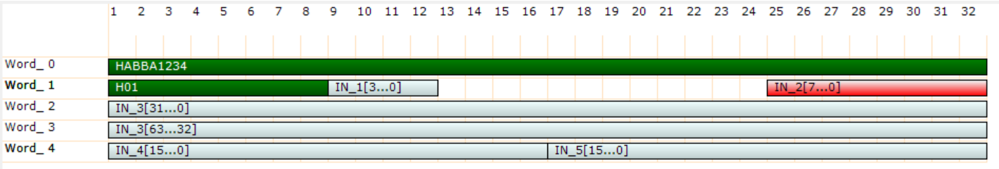
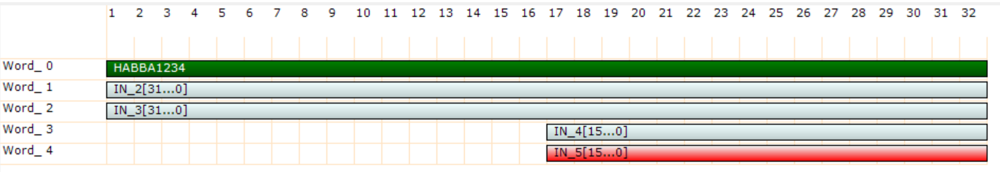
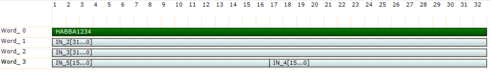

# Custom Packet driver

The custom packet allows to transfer data from FPGA to the PC in list mode.

The custom packet is particular version of the list where the user can define the data packet format.

  

In respect to the list the custom packet has a structured data type and can be decoded by the custom packet decoder.

In order to decode the custom packet it is raccomanded that the first dword (32 bit) of the custom packet is a fixed constant. This is the align world, which is exported by SciCompiler and can be used to align the custom packet. Aldo is not mandatory to have an align world, this world reduce the propability that in case of lost data, all data in the packet got lost.

The JSON that SciCompiler generates for the custom packet contains the description for every words.
Most of programming language do not allows to define data type at runtime indeed it is necessary that the user define the struct in the source code and cast the data pointer to it.
When custom packet is used in raw mode, it can be consider a list
In the end, the custom packet is no more than a list with a wrapper to format the FPGA data word

The list inside the custom packet is a FIFO buffer. The buffer is allocated in the FPGA and the data are transferred to the PC. On some board it is possible to enable DMA to speed up transfer. 
On the PC side a buffer can be allocated using the `SCISDK_AllocateBuffer` function. The buffer is freed using the `SCISDK_FreeBuffer` function.

**Decoded Mode**
Because the List is a FIFO is not possible to know a priori the number of bytes that will be transferred. The  `SCISDK_AllocateBuffer` take indeed an extra parameter to specify the size of the buffer (in packets) on the PC side; the `SCISDK_ReadData` function will try to read the maximum number of bytes that can fit in the buffer. 

*It is important to note that the buffer size is specified in packets and not in bytes. The FPGA packet size is specified in SciCompiler (i the example in the figure above the packet size is 5 DWORD, that means 5*32bit = 160bit or 20 bytes). This is always a multiple of 32 bits (DWORD). All transfer will always be done with a size multiple of the FPGA packet size. This ensure that is not possible to read partial packet that will corrupt data in an urecoverable way*

**Raw Mode**
In raw mode the costom packet do not process packet and ignore the information on packet size and structure present in the JSON. 
It assume that the packet size is 1 DWORD and the last argument of  `SCISDK_AllocateBuffer` specify the size in DWORD of the user buffer.  `SCISDK_ReadData` will try to fill this buffer that is no more alligned to packet size.


The readout can be configure to work in two different mode:
- blocking : the `SCISDK_ReadData` function will block until the buffer is full or the timeout is reached.
- non-blocking : the `SCISDK_ReadData` function will return immediately with the number of bytes read.

More over the list can be configured to work:
- polling : the `SCISDK_ReadData` function will read the data from the hardware FIFO when the user call the function.
- threaded : on start command, the list will start a thread that will read the data from the hardware FIFO and store it in an internal buffer (thread buffer). The `SCISDK_ReadData` function will read the data from the thread buffer.
Thread mode increase the perfomance of the list because, while the use elaborate the previous data, the list accumulate next data in the thread buffer.

## Parameters
The following parameters can be configured:

| Parameter             | Acces Mode | Description                                                                              | Default value |
| --------------------- | ---------- | ---------------------------------------------------------------------------------------- | ------------- |
| acq_len               | R/W        | maximum number of sample to be transferred per physical FIFO access                      | 1024          |
| acq_mode              | R/W        | select blocking/non-blocking mode                                                        | blocking      |
| timeout               | R/W        | set the timout in ms in blocking mode                                                    | 100           |
| thread                | R/W        | enable the internal thread: true/false                                                   | false         |
| high_performance      | R/W        | if true the internal FIFO access lock the bus in priority mode.                          | false         |
| threaded_buffer_size  | R/W        | size in dword of the internal buffer                                                     | 100000        |
| check_align_word      | R/W        | if true, check the packet alignment                                                      | false         |
| data_processing       | R/W        | set data processing mode: raw, decode                                                    | decode        |
| buffer_type           | R          | get buffer type: SCISDK_OSCILLOSCOPE_RAW_BUFFER or SCISDK_OSCILLOSCOPE_DECODED_BUFFER    |               |

### Acquisition length
The `acq_len` parameter is the maximum number of sample to be transferred per physical FIFO access. This parameter has an impact on the transfer speed. As bigger is the value, as faster is the transfer. Bigger value will lock the bus for a longer time and can cause a loss of data if the readout channel is shared between multiple readout block (for example multiple list or custom packet).
The raccomanded value is the 90% size of the size of the internal FIFO.
This parameter is expressed in packets.


### Blocking/Non blocking mode

In blocking mode the `SCISDK_ReadData` function will block until the buffer is full or the timeout is reached. In non-blocking mode the `SCISDK_ReadData` function will return immediately with the number of bytes read.
The maximum number of bytes that can be read is the size of the buffer allocated with the function `SCISDK_AllocateBuffer`.
In blocking mode the timeout is set with the `timeout` parameter. The timeout is expressed in ms. In non-blocking mode the timeout is not used.
In both mode, if the buffer is fill with even just a single word the function will return NI_OK. 
If there is no data at all the read function will return NI_NO_DATA_AVAILABLE.

### Threaded mode

In threaded mode the list will start a thread that will read the data from the hardware FIFO and store it in an internal buffer (thread buffer). The `SCISDK_ReadData` function will read the data from the thread buffer.
While in polling mode, if the user do not call the `SCISDK_ReadData` function, the FIFO in the FPGA can be full and the data will be lost. In threaded mode the data are stored in the thread buffer automatically. The internall thread will poll the FPGA to check if data is available and will store it in the thread buffer.
Thread mode increase the perfomance of the list because, but consume continuously the communication bandiwdth between the FPGA and the PC. The user lost the control on how much time the specific list will access to the shared bus.

### High performance mode
We discurage to enable this parameter. If enabled, the highe performace mode force the internal physical ReadFIFO function to ignore the word available field of the FIFO. When this parameter is disable, the ReadFIFO function check the word available field of the FIFO and will make a read only if this number if not 0. More over the read size will be the minimum between word available and acq_len parameter.
In this way the ReadFIFO function will not lock the bus for a long time. In high perforamnce mode, the ReadFIFO will always setup a read cycle with size equal to acq_len parameter. This will lock the bus for a long time untill all data are received.
This will increase significantly the transfer speed but no other access, even to read/write register can be done until all data are received or the timeout is reached.
Use this mode only if you are sure that the bus is not shared with other readout block and you don't need 


## Allignment check
The `check_align_word` parameter can be used to check the packet alignment. If enabled, the `SCISDK_ReadData` function will check if the data are alligned to the packet.
The alignament algorithm is the following:
- first check the JSON from SciCompiler if the first word in the packet definition is a constant. This will be the alignament word.
- read a bounce of data from the FPGA fifo
- check if the first world in the bounce is the alignament word, if not, discard data until the alignament word is found.

In order to set to true the `check_align_word` parameter, the first word in the packet definition must be a constant. If the first word is a variable, the `check_align_word` parameter will be set to false and any attempt to set it to true will return NI_PARAMETER_CAN_NOT_BE_SET_WITH_THIS_CONFIG.

## Data processing mode
The `data_processing` parameter can be used to set the data processing mode. The data processing mode can be set to raw or decode.
In raw mode the data are not processed and the user will receive the raw data from the FPGA. In decode mode the data are processed and the user will receive the data as they are pushed in the FPGA fifo, loosing the concept of packet. The custom packet behavior is the same of the list
In decode mode the data are analized, divided in packet and it is possible to check the alignment to an aligment word.

## Commands
The following commands are available:

| Command               | Description                                                                    | Parameter |
| --------------------- | ------------------------------------------------------------------------------ | --------- |
| start                 | Clear the FIFO and start the acqusition                                        |           |
| stop                  | Stop the acquisition                                                           |           |

Start will clear the list content, create the internal thread and allocate the thread buffer if thread mode is enable and start the acquisition.
All list parameter can not be changed while the acquisition is in progress. Stop the list before change any parameter or the property set will be rejected.

## Buffer Allocation
The buffer is allocated using the `SCISDK_AllocateBuffer` function. The buffer is freed using the `SCISDK_FreeBuffer` function.
Because the List inside the Custom Packet is a FIFO is not possible to know a priori the number of bytes that will be transferred. The  `SCISDK_AllocateBuffer` take indeed an extra parameter to specify the size of the buffer (in packet) on the PC side; the `SCISDK_ReadData` function will try to read the maximum number of bytes that can fit in the buffer.


This is an example on how allocate a Custom Packet Buffer:
```c
SCISDK_AllocateBuffer(<path to custom packet>, T_BUFFER_TYPE_RAW, (void**)&cp_data, <number of packets>)
```

The buffer allocated with the `SCISDK_AllocateBuffer` function has a last size parameters containing the number of packet the user want to allocate in the buffer.
For example if the user create in SciCompiler a custom packet with 5 rows (32 bit per row) and want to allocate a buffer with 1000 packets, the function will allocate a buffer with 16000 bytes. The  `SCISDK_ReadData` function will try to fill the buffer with 16000 bytes (1000 words * 16 bytes) each time is called.
It is crtical to ensure that the transfer will always be aligned to the word size to avoid to read partial words with irrecoverable data loss.

This example allocate a buffer with 1000 packet:

```c
SCISDK_CP_DECODED_BUFFER cp_data;
SCISDK_AllocateBuffer("board0:/MMCComponents/CP_0", T_BUFFER_TYPE_DECODE, (void**)&cp_data, 1000)
```

It is also possible to allocate RAW buffer, in that case the size of packet is fixed to 1 row (1DWORD), the buffer size fo 1000 packets will be 4000 bytes, indipendently from the number of rows in the custom packet.

```c
 SCISDK_CP_RAW_BUFFER cp_data;
SCISDK_AllocateBuffer("board0:/MMCComponents/CP_0", T_BUFFER_TYPE_RAW, (void**)&cp_data, 1000)
```

## Output data Format
### Raw Data
The data output structure is the following:
```c

	typedef struct {
		uint32_t magic;				
		uint32_t *data;				
		struct {
			uint32_t buffer_size;	
			uint32_t valid_data;	
		} info;
	}SCISDK_CP_RAW_BUFFER;
```
`magic` : magic number to identify the buffer type. It is set to SCISDK_CP_RAW_BUFFER_MAGIC
`data` : it's the array of the raw data. The data is stored as a uint32_t array. 
No further details on data decode is provided for raw mode. Raw mode is provided for post processing porpouse of the data. is just usefull to read data in a buffer and store it in a file. The decode should be done in post processing.

### Decoded Data
The data output structure is the following:
```c
	typedef struct {
		uint32_t magic;					
		SCISDK_CP_PACKET *data;			
		struct {
			uint32_t buffer_size;		
			uint32_t packet_size;		
			uint32_t valid_data;		
		} info;
	}SCISDK_CP_DECODED_BUFFER;

	typedef struct {
		uint32_t *row;			
		uint32_t n;			
	}SCISDK_CP_PACKET;
```

`magic` : magic number to identify the buffer type. It is set to SCISDK_CP_DECODED_BUFFER_MAGIC
`data` : it's the array of the decoded data. The data is stored as a SCISDK_CP_PACKET array.
`buffer_size` : the number of packet that can fit in the buffer
`packet_size` : the number of row in the packet
`valid_data` : the number of valid packet in the buffer

The SCISDK_CP_PACKET rappresent the single data packet. It is composed by an array of row and the number of row in the packet.
`row` : it's the array of the decoded data. The data is stored as a uint32_t array.
`n` : it's the number of row in the packet. In the actual implementation the number of row in the packet is always the same for all the packet in the buffer and is equal to 
`packet_size`.

If the inputs of the custom packet are all aligned to 32bit the decode of the data is very simple. Just read the data in the struct, from first to last row and this is mapped 1:1 to the input of the custom packet.

  

```c
for (int i = 0; i < cp_data->info.valid_data; i++) {
		printf("ALIGN WORD 0x%08x ", cp_data->data[i].row[0]);
		printf("IN2 0x%08x ", cp_data->data[i].row[1]);
		printf("IN3 0x%08x ", cp_data->data[i].row[2]);
		printf("IN4 0x%08x ", cp_data->data[i].row[3]);
		printf("IN5 0x%08x ", cp_data->data[i].row[4]);

	}
	printf("\n");
}
```
If multiple input of the custom packet are packed in a single word, the decode of the data is more complex. The user may use shift and mast operation to access to the data

  

```c
for (int i = 0; i < cp_data->info.valid_data; i++) {
		printf("ALIGN WORD 0x%08x ", cp_data->data[i].row[0]);
		printf("IN2 0x%08x ", cp_data->data[i].row[1]);
		printf("IN3 0x%08x ", cp_data->data[i].row[2]);
		printf("IN4 0x%08x ", (cp_data->data[i].row[3] >> 0) & 0xFFFF);
		printf("IN5 0x%08x ", (cp_data->data[i].row[3] >> 16) & 0xFFFF);
	}
	printf("\n");
}
```

The is also the possibility, in some programming language to cast the packet buffer to a struct.
Consider the first example, a PSD (pulse shape discrimination) that produce for each event a packet with channel identificatiom, timestamp, two charge measure (Qshort/Qlong) and four flags.:

  

We can immagine a packet struct like this:

ROW 0:
- 32 bit word alignament fixed to 0xABBA1234
ROW 1:
- 8 bit constant value fixed to identify the type of the packet (0x01)
- 4 bit flags from IN_1:
  - pileup
  - global_trigger_fired
  - local_trigger_fired
  - calibration
- 12 spare bits
- 8 bit channel number from IN_2
ROW 2 and 3:
- 64 bit timestamp from IN_3 
ROW 4:
- 16 bit energy (Qshort) from IN_4
- 16 bit energy (Qlong) from IN_5

This example show how to cast the data to a pack struct:

```c
typedef struct __attribute__((__packed__)) struct {
	uint32_t align_word : 32;
	uint8_t pk_type : 8;
	uint8_t pileup : 1;
	uint8_t global_trigger_fired : 1;
	uint8_t local_trigger_fired : 1;
	uint8_t calibration : 1;
	uint16_t spare : 12;
	uint8_t channel : 8;
	uint64_t timestamp : 64;
	uint16_t qshort : 16;
	uint16_t qlong : 16;
}DATA_STRUCT;

DATA_STRUCT *data = (DATA_STRUCT*)list_data->data;
for (int i = 0; i < list_data->info.valid_samples; i++) {
	printf("Timestamp %d\n", data[i].timestramp);
	printf("PILEUP: %d    GBL_TRG: %d    LOC_TRG: %d   CAL: %d\n", 
					data[i].pileup,
					data[i].global_trigger_fired,
					data[i].local_trigger_fired,
					data[i].calibration);
	printf("Qshort: %6d   Qlong: %6d\n", data[i].qshort);
	printf("Qshort: %6d   Qlong: %6d\n", data[i].qlong);
}
```


## Basic Examples
### C

**Simple example with raw data**
```c
SCISDK_CP_RAW_BUFFER *lrb;
ret = SCISDK_AllocateBufferSize((char*)("board0:/MMCComponents/CP_0"), T_BUFFER_TYPE_RAW, (void**)&lrb, _sdk, 1024);

if (ret != NI_OK) {
	printf("Error allocating buffer\n");
	return -1;
}
SCISDK_SetParameterString("board0:/MMCComponents/CP_0.data_processing", "raw", _sdk);
SCISDK_SetParameterString("board0:/MMCComponents/CP_0.thread", "false", _sdk);
SCISDK_SetParameterInteger("board0:/MMCComponents/CP_0.timeout", 5000, _sdk);
SCISDK_SetParameterString("board0:/MMCComponents/CP_0.acq_mode", "blocking", _sdk);
SCISDK_ExecuteCommand("board0:/MMCComponents/CP_0.start", "", _sdk);

ret = SCISDK_ReadData("board0:/MMCComponents/CP_0", (void *)lrb, _sdk);	
		
if (ret == NI_OK) {
	printf("Read %d DWORD from packet buffer:\n", lrb->info.valid_data);
	for (int i = 0; i < lrb->info.valid_data; i++) {
		printf("0x%08x ", lrb->data[i]);
	}
	printf("\n");
	
}
```

Expected output will be something like this:
```
Read 1024 DWORD from packet buffer:
0xABBA1234
0x01600001
0x00000023
0x00000123
0x12300067
0xABBA1234
0x01600001
0x00013000
0x00000123
0x02510168
....
```

**Simple example with decoded data**
```c
SCISDK_CP_DECODED_BUFFER *lrb;
ret = SCISDK_AllocateBufferSize((char*)("board0:/MMCComponents/CP_0"), T_BUFFER_TYPE_DECODED, (void**)&lrb, _sdk, 1024);

if (ret != NI_OK) {
	printf("Error allocating buffer\n");
	return -1;
}

SCISDK_SetParameterString("board0:/MMCComponents/CP_0.data_processing", "decode", _sdk);
SCISDK_SetParameterString("board0:/MMCComponents/CP_0.thread", "false", _sdk);
SCISDK_SetParameterInteger("board0:/MMCComponents/CP_0.timeout", 5000, _sdk);
SCISDK_SetParameterString("board0:/MMCComponents/CP_0.acq_mode", "blocking", _sdk);
SCISDK_ExecuteCommand("board0:/MMCComponents/CP_0.start", "", _sdk);

ret = SCISDK_ReadData("board0:/MMCComponents/CP_0", (void *)lrb, _sdk);

if (ret == NI_OK) {
	printf("Read %d packets from packet buffer:\n", lrb->info.valid_data);
	for (int i = 0; i < lrb->info.valid_data; i++) {
		printf("PACKET %d\n", i);
		for int j = 0; j < lrb->info.data[i].n; j++) {
			printf("		0x%08x ", lrb->data[i].row[j]);
		}
	}
	printf("\n");
}
```


Expected output will be something like this:
```
Read 50 packets from packet buffer:
PACKET 0
		0xABBA1234
		0x01600001
		0x00000023
		0x00000123
		0x12300067
PACKET 1
		0xABBA1234
		0x01600001
		0x00013000
		0x00000123
		0x02510168
....
```


### C++
```cpp
SCISDK_CP_DECODED_BUFFER *lrb;
sdk->AllocateBufferSize("board0:/MMCComponents/CP_0", 1, (void**)&lrb, 1024);
sdk->SetParameter("board0:/MMCComponents/CP_0.data_processing", "decode");
sdk->SetParameter("board0:/MMCComponents/CP_0.thread", "false");
sdk->SetParameter("board0:/MMCComponents/CP_0.timeout", 5000);
sdk->SetParameter("board0:/MMCComponents/CP_0.acq_mode", "blocking");
sdk->ExecuteCommand("board0:/MMCComponents/CP_0.start", "");

int res = sdk->ReadData("board0:/MMCComponents/CP_0", (void *)lrb);

if (res != NI_OK) {
	printf("Error reading data\n");
	return -1;
}
```

### Python
```python
res, lrb = sdk.AllocateBufferSize("board0:/MMCComponents/CP_0", 1, 1024)

if res != 0:
	print("Error allocating buffer")
	exit(-1)

sdk.SetParameter("board0:/MMCComponents/CP_0.thread", "false")
sdk.SetParameter("board0:/MMCComponents/CP_0.data_processing", "decode")
sdk.SetParameter("board0:/MMCComponents/CP_0.timeout", 5000)
sdk.SetParameter("board0:/MMCComponents/CP_0.acq_mode", "blocking")
sdk.ExecuteCommand("board0:/MMCComponents/CP_0.start", "")

res, lrb = sdk.ReadData("board0:/MMCComponents/CP_0", lrb)
```

### C Sharp

```csharp
SCISDK_CP_DECODED_BUFFER lrb = new SCISDK_CP_DECODED_BUFFER();
sdk.AllocateBufferSize("board0:/MMCComponents/CP_0", 1, ref lrb, 1024);
sdk.SetParameter("board0:/MMCComponents/CP_0.data_processing", "decode");
sdk.SetParameter("board0:/MMCComponents/CP_0.thread", "false");
sdk.SetParameter("board0:/MMCComponents/CP_0.timeout", 5000);
sdk.SetParameter("board0:/MMCComponents/CP_0.acq_mode", "blocking");
sdk.ExecuteCommand("board0:/MMCComponents/CP_0.start", "");

int res = sdk.ReadData("board0:/MMCComponents/CP_0", ref lrb);

if (res != 0) {
	Console.WriteLine("Error reading data");
	return -1;
}

```

### VB.NET


```vb

Dim lrb As New SCISDK_CP_DECODED_BUFFER()
sdk.AllocateBufferSize("board0:/MMCComponents/CP_0", 0, lrb, 1024)
sdk.SetParameter("board0:/MMCComponents/CP_0.data_processing", "decode")
sdk.SetParameter("board0:/MMCComponents/CP_0.thread", "false")
sdk.SetParameter("board0:/MMCComponents/CP_0.timeout", 5000)
sdk.SetParameter("board0:/MMCComponents/CP_0.acq_mode", "blocking")
sdk.ExecuteCommand("board0:/MMCComponents/CP_0.start", "")

Dim res As Integer = sdk.ReadData("board0:/MMCComponents/CP_0", lrb)

If res <> 0 Then
	Console.WriteLine("Error reading data")
	Return -1
End If

```


## Additional Examples

### Decode list data in C

A multichannel system is used to detect neutron and gamma.
Neutron has a longer dacay time and gamma has a shorter decay time.
The system will use a charge integrator with two time windows to calculate Qshoe and Qlong.

ROW 0:
- 32 bit word alignament fixed to 0xABBA1234
ROW 1:
- 8 bit constant value fixed to identify the type of the packet (0x01)
- 4 bit flags from IN_1:
  - pileup
  - global_trigger_fired
  - local_trigger_fired
  - calibration
- 12 spare bits
- 8 bit channel number from IN_2
ROW 2 and 3:
- 64 bit timestamp from IN_3 
ROW 4:
- 16 bit energy (Qshort) from IN_4
- 16 bit energy (Qlong) from IN_5

```c

typedef struct __attribute__((__packed__)) struct {
	uint32_t align_word : 32;
	uint8_t pk_type : 8;
	uint8_t pileup : 1;
	uint8_t global_trigger_fired : 1;
	uint8_t local_trigger_fired : 1;
	uint8_t calibration : 1;
	uint16_t spare : 12;
	uint8_t channel : 8;
	uint64_t timestamp : 64;
	uint16_t qshort : 16;
	uint16_t qlong : 16;
}DATA_STRUCT;

SCISDK_CP_DECODED_BUFFER *lrb;
ret = SCISDK_AllocateBufferSize((char*)("board0:/MMCComponents/CP_0"), 0, (void**)&lrb, _sdk, 1024);

if (ret != NI_OK) {
	printf("Error allocating buffer\n");
	return -1;
}

SCISDK_SetParameterString("board0:/MMCComponents/CP_0.data_processing", "decode", _sdk);
SCISDK_SetParameterString("board0:/MMCComponents/CP_0.thread", "false", _sdk);
SCISDK_SetParameterInteger("board0:/MMCComponents/CP_0.timeout", 5000, _sdk);
SCISDK_SetParameterString("board0:/MMCComponents/CP_0.acq_mode", "blocking", _sdk);
SCISDK_ExecuteCommand("board0:/MMCComponents/CP_0.start", "", _sdk);

ret = SCISDK_ReadData("board0:/MMCComponents/CP_0", (void *)lrb, _sdk);
if (ret == NI_OK) {
	DATA_STRUCT *data = (DATA_STRUCT*)list_data->data;
	for (int i = 0; i < list_data->info.valid_samples; i++) {
		printf("Timestamp %d\n", data[i].timestramp);
		printf("PILEUP: %d    GBL_TRG: %d    LOC_TRG: %d   CAL: %d\n", 
						data[i].pileup,
						data[i].global_trigger_fired,
						data[i].local_trigger_fired,
						data[i].calibration);
		printf("Qshort: %6d   Qlong: %6d\n", data[i].qshort);
		printf("Qshort: %6d   Qlong: %6d\n", data[i].qlong);
	}
}
```

### Use non-blocking mode in C

```c
SCISDK_CP_DECODE_BUFFER *lrb;
ret = SCISDK_AllocateBufferSize((char*)("board0:/MMCComponents/CP_0"), 1, (void**)&lrb, _sdk, 100);

if (ret != NI_OK) {
	printf("Error allocating buffer\n");
	return -1;
}
SCISDK_SetParameterString("board0:/MMCComponents/CP_0.data_processing", "decode", _sdk);
SCISDK_SetParameterString("board0:/MMCComponents/CP_0.thread", "false", _sdk);
SCISDK_SetParameterString("board0:/MMCComponents/CP_0.acq_mode", "non-blocking", _sdk);
SCISDK_ExecuteCommand("board0:/MMCComponents/CP_0.start", "", _sdk);

while (1) {
	ret = SCISDK_ReadData("board0:/MMCComponents/CP_0", (void *)lrb, _sdk);
	if (ret == NI_OK) {
		printf("Read %d packets\n", lrb->info.valid_samples);
		//process data
		// ...
	}
	else {
		if (ret == NI_TIMEOUT) {
			printf("Timeout\n");
		}
		else if (ret == NI_NO_DATA_AVAILABLE) {
			// Do nothing, no data available
			// in case manage here a timeout
		} else {
			printf("Error reading data: %d\n", res);
			SCISDK_s_error(res, &res, _sdk);
			return -1;
		}
	}
}
```


### Dump raw data in C and than open it in python and decode it

In this example we will dump the raw data in a binary file and then we will open it in python and decode it.
We assume that the data packet is the following:
- 32 bit word alignament fixed to 0xABBA1234
- 32 bit timestamp
- 32 bit fine timestamp with 1 ps resolution
- 16 bit Qshort
- 16 bit Qlong


  

```c
//open file
FILE *fp = fopen("data.bin", "wb");
if (fp == NULL) {
	printf("Error opening file\n");
	return -1;
}

//configure CP
SCISDK_CP_RAW_BUFFER *lrb;
ret = SCISDK_AllocateBufferSize((char*)("board0:/MMCComponents/CP_0"), 0, (void**)&lrb, _sdk, 1024);

if (ret != NI_OK) {
	printf("Error allocating buffer\n");
	return -1;
}
SCISDK_SetParameterString("board0:/MMCComponents/CP_0.data_processing", "raw", _sdk);
SCISDK_SetParameterString("board0:/MMCComponents/CP_0.thread", "false", _sdk);
SCISDK_SetParameterInteger("board0:/MMCComponents/CP_0.timeout", 5000, _sdk);
SCISDK_SetParameterString("board0:/MMCComponents/CP_0.acq_mode", "blocking", _sdk);
SCISDK_ExecuteCommand("board0:/MMCComponents/CP_0.start", "", _sdk);

while(1) {
	ret = SCISDK_ReadData("board0:/MMCComponents/CP_0", (void *)lrb, _sdk);

	if (ret == NI_OK) {
		fwrite(lrb->data, 1, lrb->info.valid_samples * 4, fp);	
	}
}

fclose(fp);
```

Now we can open the file in python and decode it:

```python
import struct

with open("data.bin", "rb") as f:
	while True:
		data = f.read(4)
		if not data:
			break
		align = struct.unpack("<I", data)[0]
		if align != 0xABBA1234:
			print("Error alignament")
			break
		data = f.read(4)
		timestamp = struct.unpack("<I", data)[0]
		data = f.read(4)
		fine_timestamp = struct.unpack("<I", data)[0]
		data = f.read(4)
		qshort = struct.unpack("<H", data)[0]
		data = f.read(4)
		qlong = struct.unpack("<H", data)[0]
		print("Timestamp: %d  Fine timestamp: %d  Qshort: %d  Qlong: %d" % (timestamp, fine_timestamp, qshort, qlong))
```
