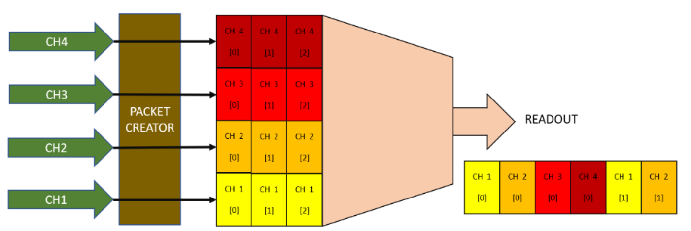
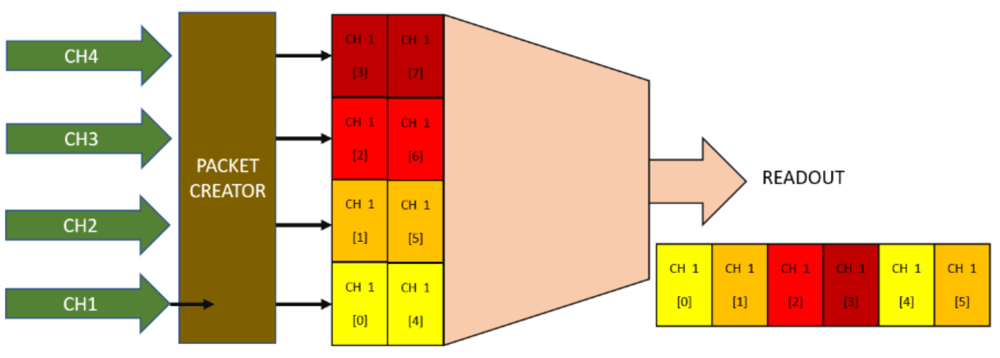
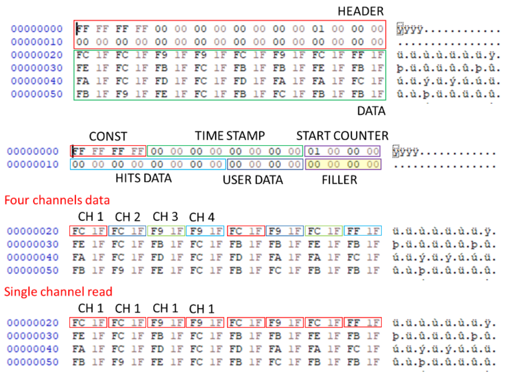

# Wave Digitizer driver

The Wave Digitizer componet has the function to acquire multiple channels capturing waveform from each one. It is similar to the oscilloscope, but, while the oscilloscope purpose is to monitor the internal process of the firmware, and indeed is not very fast in transfering data, digitizer function is optimized to maximize the speed and the memory usage of the device.
In the Wave Digitizer exist a shared memory for all channels for which the Wave Digitizer has been created. At compile time, SciCompiler defines the total size of this memory and the maximum number of channels. At runtime the user can configure if to enable one, two, four channels. The memory will be partitioned in function of the enable channels.

It is designed as following: a packet creator block serializes the enabled channels in a common FIFO and transfer data to the PC.

Every time a start signal is triggered, the timestamp, the hits and user data are captured, and enqueued in the output FIFO.

It is only possible the specify the number of channels (N) starting from the channel 0. So If N = 2, CH0 and CH1 will be dumped, if N = 4, CH0, CH1, CH2, CH3 will be dumped.

Example with four channels:

- All four channels enabled
  

- Only CH0 and CH1 enabled
  

It is not possible to configre a pre-trigger on the Wave Digitizer. The trigger is always on the first sample. To implement a pre-trigger, it necessary to connect, on each input channel, a delay block with the desired delay (SciCompiler provide fixed and programmable delay block).


The readout can be configure to work in two different mode:
- blocking : the `SCISDK_ReadData` function will block until the buffer is full or the timeout is reached.
- non-blocking : the `SCISDK_ReadData` function will return immediately with the number of bytes read.


**Raw Mode**
In raw mode the digitizer do not process packet and provide to the user application the raw data. The user application must be able to process the data and extract the information. Raw mode can be useful in order to save at the maximum speed the data to disk. The user application can be a simple script that save the data in a file. A second application can be used to process the data and extract the waveforms.


## Parameters
The following parameters can be configured:

| Parameter             | Acces Mode | Description                                                                              | Default value |
| --------------------- | ---------- | ---------------------------------------------------------------------------------------- | ------------- |
| acq_len               | R/W        | maximum number of sample to be transferred per physical FIFO access                      | 1024          |
| acq_mode              | R/W        | select blocking/non-blocking mode                                                        | blocking      |
| timeout               | R/W        | set the timout in ms in blocking mode                                                    | 100           |
| high_performance      | R/W        | if true the internal FIFO access lock the bus in priority mode.                          | false         |
| check_align_word      | R/W        | if true, check the packet alignment                                                      | false         |
| data_processing       | R/W        | set data processing mode: raw, decode                                                    | decode        |
| enabledch             | R/W        | number of enabled channels.                                                              | --all ch--    |
| buffer_type           | R          | get buffer type: SCISDK_OSCILLOSCOPE_RAW_BUFFER or SCISDK_OSCILLOSCOPE_DECODED_BUFFER    |               |
| channel_count         | R          | get buffer the number of channel created with SciCompiler                                |               |
| fifo_size             | R          | get buffer the total number of samples in the output fifo created with SciCompiler       |               |
| max_ch_samples        | R          | return the maximum number of samples per channel can be read                             |               |

### Acquisition length
The `acq_len` parameter set the number of sample per channels to be read. 
The maximum value depends by tge number of channels enabled. The maximum value is the total size of the shared memory divided by the number of channels enabled.
The driver suggest the maximum value for this parameter reading the `max_ch_samples` parameter.

### Blocking/Non blocking mode

In blocking mode the `SCISDK_ReadData` function will block until the buffer is full or the timeout is reached. In non-blocking mode the `SCISDK_ReadData` function will return immediately with the number of bytes read.
The maximum number of bytes that can be read is the size of the buffer allocated with the function `SCISDK_AllocateBuffer`.
In blocking mode the timeout is set with the `timeout` parameter. The timeout is expressed in ms. In non-blocking mode the timeout is not used.
In both mode, if the buffer is fill with even just a single word the function will return NI_OK. 
If there is no data at all the read function will return NI_NO_DATA_AVAILABLE.

### Enable channels
The `enabledch` parameter is the number of enabled channels. It is only possible the specify the number of channels (N) starting from the channel 0. So If N = 2, CH0 and CH1 will be dumped, if N = 4, CH0, CH1, CH2, CH3 will be dumped.
Valid number are from 1 to the maximum number of channels created in SciCompiler.

## Data processing mode
The `data_processing` parameter can be used to set the data processing mode. The data processing mode can be set to raw or decode.
In raw mode the data are not processed and the user will receive the raw data from the FPGA. In decode mode the data are processed and the user will receive the data as they are pushed in the FPGA fifo, loosing the concept of packet. The custom packet behavior is the same of the list
In decode mode the data are analized, divided in packet and it is possible to check the alignment to an aligment word.


## Commands
The following commands are available:

| Command               | Description                                                                    | Parameter |
| --------------------- | ------------------------------------------------------------------------------ | --------- |
| start                 | Clear the FIFO and start the acqusition                                        |           |
| stop                  | Stop the acquisition                                                           |           |

Start will clear the digitizer wave.
All digitizer parameter can not be changed while the acquisition is in progress. Stop the digitizer before change any parameter or the property set will be rejected.

## Buffer Allocation
**Raw mode**
In raw mode the buffer must be allocated with the function `SCISDK_AllocateBuffer`. In raw mode it is mandatory to specify the size of the buffer is FIFO word. The size of the FIFO word is 4 bytes (DWORD).
```c
SCISDK_AllocateBuffer(<path to list>, T_BUFFER_TYPE_RAW, (void**)&dgtz_data, <number of word>)
```

**Decoded data**
The buffer is allocated using the `SCISDK_AllocateBuffer` function. The buffer is freed using the `SCISDK_FreeBuffer` function.
There is no argument to be pass to the `SCISDK_AllocateBuffer` function. The allocator will allocate the buffer with the size for each channe large enough to contain the maximum number of samples per channel in the configuration with a single channel enabled (the worst case).

```c
SCISDK_AllocateBuffer(<path to list>, T_BUFFER_TYPE_DECODED, (void**)&dgtz_data)
```


## Output data Format

**Raw mode**
In raw mode the data are not processed and the user will receive the raw data from the FPGA. This mode is useful to implement a simple script that dump the data on file and user will post process data with a second application.

The file dumped from the script above will save the file as a list of events. 

  

The packet structure is the following:
| WORD 0  | WORD 1  | WORD 2  | WORD 3  | WORD 4  | WORD 5  | WORD 6  | WORD 7  |
| ------- | ------- | ------- | ------- | ------- | ------- | ------- | ------- |
| HEADER ||
| CH0_0   | CH1_0   | CH2_0   | CH3_0   | CH0_1   | CH1_1   | CH2_1   | CH3_1   | 
| CH0_2   | CH1_2   | CH2_2   | CH3_2   | CH0_3   | CH1_3   | CH2_3   | CH3_3   |

The header is composed by the following fields:
- Constant word:(32 bits) 0xFFFFFFFF
- Timestamp: (64 bits) timestamp
- Start counter: (32 bits) packet index
- Hits data: (64 bits) every bit represent a channel. If the bit is 1 the channel has triggered. LSB is the first channel
- User data: (32 bits) user defined dword data
- filler: the size of the filler is indicated in the table below

In order to optimize the access speed to the memory, the size of the header must be alligned to the size of the data packet; this is met by adding a padding (filler) to the header. 
This table indicate the size of the filler

| Number of channels | FIFO word size (DW) | Filler size |
| ------------------ | ------------------- | ----------- |
| 1                  | 1                   | 0           |
| 2                  | 1                   | 0           |
| 4                  | 2                   | 1           |
| 8                  | 4                   | 1           |
| 16                 | 8                   | 1           |
| 32                 | 16                  | 9           |
| 64                 | 32                  | 25          |

The channels are ordered as follow: every WORD (16 bit / 2 bytes) there is a channel.
All channels are ordered from the first to the last. In the list there is just the data of the enabled channels. After a group of channels another sample for all the channels is stored.
So the order is the following:

```
- Samples 0 
    - Channel 0
    - Channel 1
    - Channel 2
    - Channel 3
- Samples 1
    - Channel 0
    - Channel 1
    - Channel 2
    - Channel 3
  an so on
```

The data are stored in the following structure:
    
```c
	typedef struct {
		uint32_t magic;
		int32_t *data;
		struct {
			uint32_t buffer_size;
			uint32_t samples;
			uint32_t valid_samples;
			uint32_t channels;
		} info;
	}SCISDK_DIGITIZER_RAW_BUFFER;
```

The `magic` field is a constant value that can be used to check if the buffer is valid. The `data` field is a pointer to the buffer. The `data` contains data in the format above 
The `info` field contains the information about the buffer:
- `buffer_size`: the size of the buffer in DWORD (4 bytes)
- `samples`: the number of samples per channel when all the channels are enabled 
- `valid_samples`: the number of valid samples in the buffer
- `channels`: the number of channels for which the digitizer has been created 

 
**Decoded data**

In decode mode the user will receive data already decoded. The user has not to care about the packet structure and the alignment. The driver will produce in output an array with the waveform for each channel. The data are stored in the following structure:

```c
	typedef struct {
		uint32_t magic;
		int32_t *analog;
		uint64_t hits;
		uint64_t timecode;
		uint32_t counter;
		uint32_t user;
		struct {
			uint32_t samples;
			uint32_t valid_samples;
			uint32_t channels;
		} info;
	}SCISDK_DIGITIZER_DECODED_BUFFER;
```

The `magic` field is a constant value that can be used to check if the buffer is valid. The `analog` field is a pointer to the buffer. The `analog` contains data in the format above:

| CH            |     CH 0      |     CH 1      |     CH 2      |     CH 3      |
| ------------- | ------------- | ------------- | ------------- | ------------- |
| Sample        |  0 .... n-th  |  0 .... n-th  |  0 .... n-th  |  0 .... n-th  | 


The `hits` field contains the information about the channels that have triggered. The LSB is the first channel.
The `timecode` field contains the timestamp of the event.
The `counter` field contains the index of the event.
The `user` field contains the user defined dword data.
The `info` field contains the information about the buffer:
- `samples`: the number of samples per channel when all the channels are enabled
- 