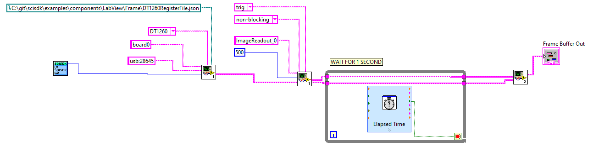
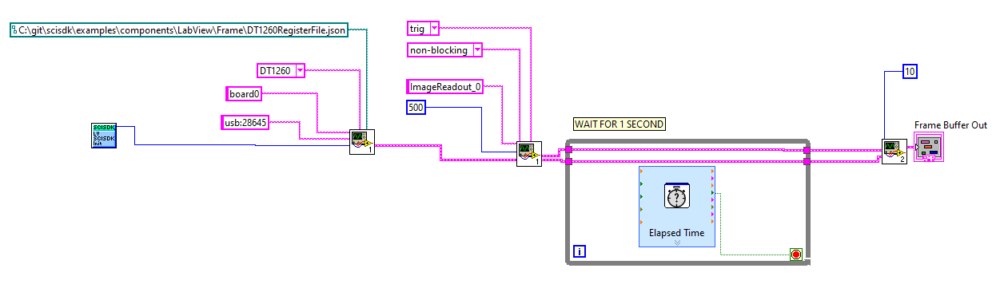

# Frame (imaging) driver

The frame driver is a special list that allow to transfer data from FPGA to the PC as pixelated images.
Each pixel is a 32 bit word, the value of the pixel is the value of the input signal at the time of the pixel acquisition.
The value of the pixel can be:
 - the ADC value of the relative input signal
 - the energy calcualted with QDC or PHA algorithm
 - the number of hits (triggers) in a fixed time window
 - the time of arrival
It depends by the kind of physical measurement that the user want to perform.

Frame transfer works in list mode. Inside the FPGA a FIFO store the packet of data each time a trigger events is detected. Trigger mode includes: external trigger, or between hits of all channels, and between all channels, trigger for a master board.

When configured in internal trigger (or/and) a coincidence windows allows a user to define a time window in which the trigger should active. The coincidence window is defined in FPGA clock cycles. For example if the sapling clock is 125 MHz and the coincidence window is 1000 FPGA clock cycles, the coincidence window is 8 us. If trigger is set to and, all channels must be active the DV input (hit) within 8us otherwise the event is ignored.

It is possible to received decoded and raw data. Raw data is the pure content of the FIFO buffer, including headers of the packet indeed should be recostructed by the user using the suggested algorithm.
Decoded data is a struct contating all the pixels and the information about the event. The struct is defined in the `scisdk_frame.h` file.

On the PC side a buffer can be allocated using the `SCISDK_AllocateBuffer` function. The buffer is freed using the `SCISDK_FreeBuffer` function.

The `SCISDK_AllocateBuffer` function requires to specify a size paramter that has a different meaning depending on the buffer type:
- RAW : the size is the number of DWORD that can be stored in the buffer
- DECODED : the size is the number of events that can be stored in the buffer

The `SCISDK_ReadData` function will read an amount of data according to the sizes programmaed in the buffer

The readout can be configure to work in two different mode:
- blocking : the `SCISDK_ReadData` function will block until the buffer is full or the timeout is reached.
- non-blocking : the `SCISDK_ReadData` function will return immediately with the number of bytes read.

More over the list can be configured to work:
- polling : the `SCISDK_ReadData` function will read the data from the hardware FIFO when the user call the function.
- threaded : on start command, the list will start a thread that will read the data from the hardware FIFO and store it in an internal buffer (thread buffer). The `SCISDK_ReadData` function will read the data from the thread buffer.
Thread mode increase the perfomance of the list because, while the use elaborate the previous data, the list accumulate next data in the thread buffer.

## Parameters
The following parameters can be configured:

| Parameter             | Acces Mode | Description                                                                              | Default value |
| --------------------- | ---------- | ---------------------------------------------------------------------------------------- | ------------- |
| acq_mode              | R/W        | select blocking/non-blocking mode                                                        | blocking      |
| data_processing       | R/W        | set data processing mode: raw, decode                                                    | decode        |
| timeout               | R/W        | set the timout in ms in blocking mode                                                    | 100           |
| thread                | R/W        | enable the internal thread: true/false                                                   | false         |
| high_performance      | R/W        | if true the internal FIFO access lock the bus in priority mode.                          | false         |
| threaded_buffer_size  | R/W        | size in dword of the internal buffer                                                     | 100000        |
| trigger_mode          | R/W        | set trigger mode: or, and, trig, sync_trig                                               | or            |
| trigger_mask          | R/W        | set bit to 1 to mask specific channel from trigger                                       | 0x00000000    |
| wait_coincidence      | R/W        | coincidence window width from trigger (clk cycles) waiting for all channels energy       | 0             |
| sync_mode             | R/W        | set the ip as master/slave                                                               | master        |
| buffer_type           | R          | get buffer type: SCISDK_OSCILLOSCOPE_RAW_BUFFER or SCISDK_OSCILLOSCOPE_DECODED_BUFFER    |               |


### Blocking/Non blocking mode

In blocking mode the `SCISDK_ReadData` function will block until the buffer is full or the timeout is reached. In non-blocking mode the `SCISDK_ReadData` function will return immediately with the number of bytes read.
The maximum number of bytes that can be read is the size of the buffer allocated with the function `SCISDK_AllocateBuffer`.
In blocking mode the timeout is set with the `timeout` parameter. The timeout is expressed in ms. In non-blocking mode the timeout is not used.
In both mode, if the buffer is fill with even just a single word the function will return NI_OK. 
If there is no data at all the read function will return NI_NO_DATA_AVAILABLE.

### Threaded mode

In threaded mode the frame will start a thread that will read the data from the hardware FIFO and store it in an internal buffer (thread buffer). The `SCISDK_ReadData` function will read the data from the thread buffer.
While in polling mode, if the user do not call the `SCISDK_ReadData` function, the FIFO in the FPGA can be full and the data will be lost. In threaded mode the data are stored in the thread buffer automatically. The internall thread will poll the FPGA to check if data is available and will store it in the thread buffer.
Thread mode increase the perfomance of the frame because, but consume continuously the communication bandiwdth between the FPGA and the PC. The user lost the control on how much time the specific frame will access to the shared bus.

### High performance mode
We discurage to enable this parameter. If enabled, the highe performace mode force the internal physical ReadFIFO function to ignore the word available field of the FIFO. When this parameter is disable, the ReadFIFO function check the word available field of the FIFO and will make a read only if this number if not 0. More over the read size will be the minimum between word available and acq_len parameter.
In this way the ReadFIFO function will not lock the bus for a long time. In high perforamnce mode, the ReadFIFO will always setup a read cycle with size equal to acq_len parameter. This will lock the bus for a long time untill all data are received.
This will increase significantly the transfer speed but no other access, even to read/write register can be done until all data are received or the timeout is reached.
Use this mode only if you are sure that the bus is not shared with other readout block and you don't need 

## Commands
The following commands are available:

| Command               | Description                                                                    | Parameter |
| --------------------- | ------------------------------------------------------------------------------ | --------- |
| start                 | Clear the FIFO and start the acqusition                                        |           |
| stop                  | Stop the acquisition                                                           |           |

Start will clear the FIFO content, create the internal thread and allocate the thread buffer if thread mode is enable and start the acquisition.
All list parameter can not be changed while the acquisition is in progress. Stop the list before change any parameter or the property set will be rejected.

## Buffer Allocation
The buffer is allocated using the `SCISDK_AllocateBuffer` function. The buffer is freed using the `SCISDK_FreeBuffer` function.
When used in RAW mode, because the frame is a FIFO, is not possible to know a priori the number of bytes that will be transferred. The  `SCISDK_AllocateBuffer` take indeed an extra parameter to specify the size of the buffer (in word) on the PC side; the `SCISDK_ReadData` function will try to read the maximum number of bytes that can fit in the buffer.

When used in DECODED mode the driver knows the number of pixel and the structure of the header and will allocate the buffer accordingly. The user specify the size in order to create a buffer capable to store multiple events (improving the performance of the readout).

This is an example on how allocate a frame buffer RAW:
```c
SCISDK_AllocateBuffer(<path to list>, T_BUFFER_TYPE_RAW, (void**)&list_data, <number of word>)
```
This example allocate a buffer with 1000 words:

```c
SCISDK_LIST_RAW_BUFFER list_data;
SCISDK_AllocateBuffer("board0:/MMCComponents/Frame_0", T_BUFFER_TYPE_RAW, (void**)&list_data, 1000)
```

This is an example on how allocate a frame buffer DECODED:
```c
SCISDK_AllocateBuffer(<path to list>, T_BUFFER_TYPE_DECODED, (void**)&list_data, <number of events>)
```

This example allocate a buffer with 10 events:
```c
SCISDK_LIST_DECODED_BUFFER list_data;
SCISDK_AllocateBuffer("board0:/MMCComponents/Frame_0", T_BUFFER_TYPE_DECODED, (void**)&list_data, 10)
```


## Output data Format

The IP do not support sparse data format indeed, indipendelty from the datavalid (DV) status, all pixel will be transfered to the PC, so the size of raw event or the number of pixel in the decoded event will be always the same. 

### Raw Data
The data output structure is the following:
```c
	typedef struct {
		uint32_t magic;
		uint32_t *data;
		struct {
			uint32_t buffer_size;
			uint32_t packet_size;
			uint32_t valid_data;
		} info;
	}SCISDK_FRAME_RAW_BUFFER;
```
`magic` : magic number to identify the buffer type. It is set to SCISDK_FRAME_RAW_BUFFER_MAGIC
`data` : it's the array of the raw data. The data is stored as a uint32_t word. 
In order to access to the data the user must implement a proper decoding function.

The decode algorithm appears to be a state machine that processes a sequence of bytes in a specific order to extract and decode information from them. 

The algorithm reads bytes from a queue called pQ and stores the decoded information in a data structure called p.
p is a SCISDK_FRAME_RAW_BUFFER struct. 
The state machine has the following states, in every step the algorithm pop the front element of the queue pQ and processes it:

`HEADER_1`: In this state, the algorithm checks if the front element of the queue pQ is equal to 0xFFFFFFFF. If it is, the state machine transitions to the HEADER_2 state. Otherwise, it remains in the HEADER_1 state discardinf data.

`HEADER_2`: In this state, the algorithm checks if the front element of the queue pQ is equal to 0x12345678. If it is, the state machine transitions to the TIMESTAMP_1 state. Otherwise, it transitions back to the HEADER_1 state.

`TIMESTAMP_1`: In this state, the algorithm extracts the front element of the queue pQ and stores it as the most significant 32 bits of a 64-bit timestamp in p. The state machine then transitions to the TIMESTAMP_2 state.

`TIMESTAMP_2`: In this state, the algorithm extracts the front element of the queue pQ and stores it as the least significant 32 bits of the timestamp in p. The state machine then transitions to the COUNT_IN_1 state.

`COUNT_IN_1`: In this state, the algorithm extracts the front element of the queue pQ and stores it as the most significant 32 bits of a 64-bit trigger count in p. The state machine then transitions to the COUNT_IN_2 state.

`COUNT_IN_2`: In this state, the algorithm extracts the front element of the queue pQ and stores it as the least significant 32 bits of the trigger count in p. The state machine then transitions to the COUNT_OUT_1 state.

`COUNT_OUT_1`: In this state, the algorithm extracts the front element of the queue pQ and stores it as the most significant 32 bits of a 64-bit event count in p. The state machine then transitions to the COUNT_OUT_2 state.

`COUNT_OUT_2`: In this state, the algorithm extracts the front element of the queue pQ and stores it as the least significant 32 bits of the event count in p. The state machine then transitions to the HITS_1 state.

`HITS_1`: In this state, the algorithm extracts the front element of the queue pQ and stores it as the number of hits in p. If the number of channels is greater than 32, the state machine transitions to the HITS_2 state. Otherwise, it transitions to the PIXELS state.

`HITS_2`: In this state, the algorithm extracts the front element of the queue pQ and stores it as the number of additional hits in p. The state machine then transitions to the PIXELS state.

`PIXELS`: In this state, the algorithm extracts all the pixels data value. The use must provide the information of the number of pixel present in the IP from the front of the queue pQ and

### Decoded Data
The data output structure is the following:
```c
	typedef struct {
		uint32_t *pixel;
		uint32_t n;
		struct {
			uint64_t timestamp;
			uint64_t trigger_count;
			uint64_t event_count;
			uint64_t hits;
		};
	}SCISDK_FRAME_PACKET;

	typedef struct {
		uint32_t magic;
		SCISDK_FRAME_PACKET *data;
		struct {
			uint32_t buffer_size;
			uint32_t valid_data;
		} info;
	}SCISDK_FRAME_DECODED_BUFFER;
```
`magic` : magic number to identify the buffer type. It is set to SCISDK_LIST_RAW_BUFFER_MAGIC
`pixel` : it's the array of the pixel data. The data is stored as an array of uint32_t word.
`n` : it's the number of pixel in the event.
`timestamp` : it's the timestamp of the event.
`trigger_count` : it's the trigger count of the event. It counts the number of trigger events for the programmed trigger soruce even if the trigger is not accepted by the IP because it is busy.
`event_count` : it's the event counter of the accepted trigger.
`hits` : it's the hit flag buffer. It is a 64 bit word where each bit represents a pixel. If the bit is set to 1, the pixel has been hit.


## Basic Examples
### C RAW
```c
SCISDK_FRAME_RAW_BUFFER *lrb;
ret = SCISDK_AllocateBufferSize((char*)("board0:/MMCComponents/Frame_0"), 0, (void**)&lrb, _sdk, 1024);

if (ret != NI_OK) {
	printf("Error allocating buffer\n");
	return -1;
}

SCISDK_SetParameterString("board0:/MMCComponents/Frame_0.thread", "false", _sdk);
SCISDK_SetParameterInteger("board0:/MMCComponents/Frame_0.timeout", 5000, _sdk);
SCISDK_SetParameterString("board0:/MMCComponents/Frame_0.acq_mode", "blocking", _sdk);
SCISDK_SetParameterString("board0:/MMCComponents/Frame_0.data_processing", "raw", _sdk);
SCISDK_SetParameterString("board0:/MMCComponents/Frame_0.trigger_mode", "or", _sdk);
SCISDK_SetParameterString("board0:/MMCComponents/Frame_0.sync_mode", "master", _sdk);
SCISDK_ExecuteCommand("board0:/MMCComponents/Frame_0.start", "", _sdk);

ret = SCISDK_ReadData("board0:/MMCComponents/Frame_0", (void *)lrb, _sdk);	
		
```


### C DECODED
```c
SCISDK_FRAME_DECODED_BUFFER *drb;
ret = SCISDK_AllocateBufferSize((char*)("board0:/MMCComponents/Frame_0"), 0, (void**)&drb, _sdk, 10);

if (ret != NI_OK) {
	printf("Error allocating buffer\n");
	return -1;
}

SCISDK_SetParameterString("board0:/MMCComponents/Frame_0.thread", "false", _sdk);
SCISDK_SetParameterInteger("board0:/MMCComponents/Frame_0.timeout", 5000, _sdk);
SCISDK_SetParameterString("board0:/MMCComponents/Frame_0.acq_mode", "blocking", _sdk);
SCISDK_SetParameterString("board0:/MMCComponents/Frame_0.data_processing", "decode", _sdk);
SCISDK_SetParameterString("board0:/MMCComponents/Frame_0.trigger_mode", "or", _sdk);
SCISDK_SetParameterString("board0:/MMCComponents/Frame_0.sync_mode", "master", _sdk);
SCISDK_ExecuteCommand("board0:/MMCComponents/Frame_0.start", "", _sdk);

ret = SCISDK_ReadData("board0:/MMCComponents/Frame_0", (void *)lrb, _sdk);	
		
```


### C++ RAW
```cpp
SCISDK_FRAME_RAW_BUFFER *lrb;
sdk->AllocateBufferSize("board0:/MMCComponents/Frame_0", 0, (void**)&lrb, 1024);
sdk->SetParameter("board0:/MMCComponents/Frame_0.thread", "false");
sdk->SetParameter("board0:/MMCComponents/Frame_0.timeout", 5000);
sdk->SetParameter("board0:/MMCComponents/Frame_0.acq_mode", "blocking");
sdk->SetParameter("board0:/MMCComponents/Frame_0.data_processing", "raw");
sdk->SetParameter("board0:/MMCComponents/Frame_0.trigger_mode", "or");
sdk->SetParameter("board0:/MMCComponents/Frame_0.sync_mode", "master");
sdk->ExecuteCommand("board0:/MMCComponents/Frame_0.start", "");

int res = sdk->ReadData("board0:/MMCComponents/Frame_0", (void *)lrb);

if (res != NI_OK) {
	printf("Error reading data\n");
	return -1;
}
```

### Python RAW
```python
res, lrb = sdk.AllocateBufferSize("board0:/MMCComponents/Frame_0", 0, 1024)

if res != 0:
	print("Error allocating buffer")
	exit(-1)

sdk.SetParameter("board0:/MMCComponents/Frame_0.thread", "false")
sdk.SetParameter("board0:/MMCComponents/Frame_0.timeout", 5000)
sdk.SetParameter("board0:/MMCComponents/Frame_0.acq_mode", "blocking")
sdk.SetParameter("board0:/MMCComponents/Frame_0.data_processing", "raw")
sdk.SetParameter("board0:/MMCComponents/Frame_0.trigger_mode", "or")
sdk.SetParameter("board0:/MMCComponents/Frame_0.sync_mode", "master")
sdk.ExecuteCommand("board0:/MMCComponents/Frame_0.start", "")

res, lrb = sdk.ReadData("board0:/MMCComponents/Frame_0", lrb)
```


### Python Decoded
```python
res, drb = sdk.AllocateBufferSize("board0:/MMCComponents/Frame_0", 0, 10)

if res != 0:
	print("Error allocating buffer")
	exit(-1)

sdk.SetParameter("board0:/MMCComponents/Frame_0.thread", "false")
sdk.SetParameter("board0:/MMCComponents/Frame_0.timeout", 5000)
sdk.SetParameter("board0:/MMCComponents/Frame_0.acq_mode", "blocking")
sdk.SetParameter("board0:/MMCComponents/Frame_0.data_processing", "decode")
sdk.SetParameter("board0:/MMCComponents/Frame_0.trigger_mode", "or")
sdk.SetParameter("board0:/MMCComponents/Frame_0.sync_mode", "master")
sdk.ExecuteCommand("board0:/MMCComponents/Frame_0.start", "")

res, lrb = sdk.ReadData("board0:/MMCComponents/Frame_0", drb)
```

### C Sharp RAW

```csharp
SciSDKFrameRawBuffer lrb = new SciSDKFrameRawBuffer();
sdk.AllocateBufferSize("board0:/MMCComponents/Frame_0", 0, ref lrb, 1024);
sdk.SetParameter("board0:/MMCComponents/Frame_0.thread", "false");
sdk.SetParameter("board0:/MMCComponents/Frame_0.timeout", 5000);
sdk.SetParameter("board0:/MMCComponents/Frame_0.acq_mode", "blocking");
sdk.SetParameter("board0:/MMCComponents/Frame_0.data_processing", "raw");
sdk.SetParameter("board0:/MMCComponents/Frame_0.trigger_mode", "or");
sdk.SetParameter("board0:/MMCComponents/Frame_0.sync_mode", "master");
sdk.ExecuteCommand("board0:/MMCComponents/Frame_0.start", "");

int res = sdk.ReadData("board0:/MMCComponents/Frame_0", ref lrb);

if (res != 0) {
	Console.WriteLine("Error reading data");
	return -1;
}

```

### VB.NET RAW


```vb

Dim lrb As New SciSDKFrameRawBuffer()
sdk.AllocateBufferSize("board0:/MMCComponents/Frame_0", 0, lrb, 1024)
sdk.SetParameter("board0:/MMCComponents/Frame_0.thread", "false")
sdk.SetParameter("board0:/MMCComponents/Frame_0.timeout", 5000)
sdk.SetParameter("board0:/MMCComponents/Frame_0.acq_mode", "blocking")
sdk.SetParameter("board0:/MMCComponents/Frame_0.data_processing", "raw")
sdk.SetParameter("board0:/MMCComponents/Frame_0.trigger_mode", "or")
sdk.SetParameter("board0:/MMCComponents/Frame_0.sync_mode", "master")
sdk.ExecuteCommand("board0:/MMCComponents/Frame_0.start", "")

Dim res As Integer = sdk.ReadData("board0:/MMCComponents/Frame_0", lrb)

If res <> 0 Then
	Console.WriteLine("Error reading data")
	Return -1
End If

```

### JAVA DECODED
```java
res = sdk.SetParameterString("board0:/MMCComponents/ImageReadout_0.thread", "false");
res = sdk.SetParameterInteger("board0:/MMCComponents/ImageReadout_0.timeout", 500);
res = sdk.SetParameterString("board0:/MMCComponents/ImageReadout_0.acq_mode", "non-blocking");
res = sdk.SetParameterString("board0:/MMCComponents/ImageReadout_0.trigger_mode", "trig");
res = sdk.SetParameterString("board0:/MMCComponents/ImageReadout_0.data_processing", "decode");

// allocate buffer
Ref<FrameDecodedBuffer> fdb = new Ref(new FrameDecodedBuffer());
res = sdk.AllocateBuffer("board0:/MMCComponents/ImageReadout_0", fdb, 100);

res = sdk.ExecuteCommand("board0:/MMCComponents/ImageReadout_0.start", "");
if(res == 0) {
	res = sdk.ReadData("board0:/MMCComponents/ImageReadout_0", fdb);
}
```
### Labview Single



<i>You can find the labview file for this example [here](../examples/components/LabView/Frame/Frame%20Single.vi)</i>

### Labview Multiple



<i>You can find the labview file for this example [here](../examples/components/LabView/Frame/Frame%20Multiple.vi)</i>

## Additional Examples

### C read and print decoded data

This example print a decoded frame to the console.


```c
SCISDK_FRAME_DECODED_BUFFER *drb;
ret = SCISDK_AllocateBufferSize((char*)("board0:/MMCComponents/Frame_0"), 0, (void**)&drb, _sdk, 10);

if (ret != NI_OK) {
	printf("Error allocating buffer\n");
	return -1;
}

SCISDK_SetParameterString("board0:/MMCComponents/Frame_0.thread", "false", _sdk);
SCISDK_SetParameterInteger("board0:/MMCComponents/Frame_0.timeout", 5000, _sdk);
SCISDK_SetParameterString("board0:/MMCComponents/Frame_0.acq_mode", "blocking", _sdk);
SCISDK_SetParameterString("board0:/MMCComponents/Frame_0.data_processing", "decode", _sdk);
SCISDK_SetParameterString("board0:/MMCComponents/Frame_0.trigger_mode", "or", _sdk);
SCISDK_SetParameterString("board0:/MMCComponents/Frame_0.sync_mode", "master", _sdk);
SCISDK_ExecuteCommand("board0:/MMCComponents/Frame_0.start", "", _sdk);

ret = SCISDK_ReadData("board0:/MMCComponents/Frame_0", (void *)lrb, _sdk);	

if (ret != NI_OK) {
	printf("Error reading data\n");
	return -1;
}

for (int i = 0; i < drb->valid_data; i++) {
	printf("**** Frame %d ****\n", i);

	printf("Timestamp: %d\n", drb->data[i].info.timestamp);
	printf("Event: %d\n", drb->data[i].info.event_count);
	printf("Trigger: %d\n", drb->data[i].info.trigger_count);
	printf("HITS: %X\n", drb->data[i].info.hits);

	for (int j = 0; j < drb->data[i].n; j++) {
		printf("%8d ", drb->data[i].pixel[j]);
	}
	printf("\n");
}

		
```


### Example of decoding RAW data in C++

Suppose to have dump the raw data field of the frame into a file called data.bin.

```c

#include <iostream>
#include <fstream>
#include <queue>

uint32_t packet_size = 32+9;	//<<write here the packet size in DWORD, it is written in the json>>
uint32_t channels=32;			//<<write here the number of channels, it is written in the json>>

// we suppose to use the SCISDK_FRAME_PACKET to store the event
enum class DECODE_SM {
	HEADER_1,
	HEADER_2,
	TIMESTAMP_1,
	TIMESTAMP_2,
	COUNT_IN_1,
	COUNT_IN_2,
	COUNT_OUT_1,
	COUNT_OUT_2,
	HITS_1,
	HITS_2,
	PIXELS
} ;


SCISDK_FRAME_PACKET p;

p.pixel = (uint32_t*)malloc(sizeof(uint32_t)*channels);

if (p.pixel == NULL) {
	std::cerr << "Error: failed to allocate memory." << std::endl;
	return 1;
}

std::ifstream file("data.bin", std::ios::binary);
// Check if the file was successfully opened
if (!file.is_open()) {
std::cerr << "Error: failed to open file." << std::endl;
return 1;
}

// Create a queue to hold the data
std::queue<uint32_t> pQ;

// Read the data from the file and push it onto the queue
uint32_t data;
while (file.read((char*)&data, sizeof(data))) {
pQ.push(data);
}

// Close the file
file.close();
  

if (pQ.size() >= packet_size) {
	DECODE_SM sm;
	sm = DECODE_SM::HEADER_1;
	while (pQ.size() >= packet_size) {
		switch (sm) {
			case DECODE_SM::HEADER_1 : 
				if (pQ.front() == 0xFFFFFFFF){
					sm = DECODE_SM::HEADER_2;
					ridx = 0;
				} 
				break;
			case DECODE_SM::HEADER_2:
				if (pQ.front() == 0x12345678) {
					sm = DECODE_SM::TIMESTAMP_1;
				}
				break;
			case DECODE_SM::TIMESTAMP_1:
				p.info.timestamp = ((uint64_t)pQ.front()) << 32UL;
				sm = DECODE_SM::TIMESTAMP_2;
				break;
			case DECODE_SM::TIMESTAMP_2:
				p.info.timestamp += ((uint64_t)pQ.front());
				sm = DECODE_SM::COUNT_IN_1;
				break;
			case DECODE_SM::COUNT_IN_1:
				p.info.trigger_count = ((uint64_t)pQ.front()) << 32UL;
				sm = DECODE_SM::COUNT_IN_2;
				break;
			case DECODE_SM::COUNT_IN_2:
				p.info.trigger_count += ((uint64_t)pQ.front());
				sm = DECODE_SM::COUNT_OUT_1;
				break;
			case DECODE_SM::COUNT_OUT_1:
				p.info.event_count = ((uint64_t)pQ.front()) << 32UL;
				sm = DECODE_SM::COUNT_OUT_2;
				break;
			case DECODE_SM::COUNT_OUT_2:
				p.info.event_count += ((uint64_t)pQ.front());
				sm = DECODE_SM::HITS_1;
				break;
			case DECODE_SM::HITS_1:
				p.info.hits = ((uint64_t)pQ.front());
				if (channels > 32) {
					sm = DECODE_SM::HITS_2;
				}
				else {
					sm = DECODE_SM::PIXELS;
				}
				break;
			case DECODE_SM::HITS_2:
				p.info.hits += ((uint64_t)pQ.front()) << 32UL;
				sm = DECODE_SM::PIXELS;
				break;
			case DECODE_SM::PIXELS:
				p.pixel[ridx++] = pQ.front();
				if (ridx == channels) {
					/*
						Event is decoded and ready to be used
					*/
					sm = DECODE_SM::HEADER_1;
				}
				break;
		}

		pQ.pop();
		
	}
} else {
	/*
		Not enough data to decode the event
	*/
}

```

### Example of decoding RAW data in Python

Suppose to have dump the raw data field of the frame into a file called data.bin

```python

import struct

packet_size = 32+9  # packet size in DWORD, written in the json
channels = 32  # number of channels, written in the json

# we suppose to use the SCISDK_FRAME_PACKET to store the event
class DECODE_SM:
    HEADER_1 = 0
    HEADER_2 = 1
    TIMESTAMP_1 = 2
    TIMESTAMP_2 = 3
    COUNT_IN_1 = 4
    COUNT_IN_2 = 5
    COUNT_OUT_1 = 6
    COUNT_OUT_2 = 7
    HITS_1 = 8
    HITS_2 = 9
    PIXELS = 10

# create a queue to hold the data
pQ = deque()  

# read the data from the file and push it onto the queue
with open("data.bin", "rb") as file:
    while True:
        data = file.read(4)
        if not data:
            break
        pQ.append(struct.unpack("I", data)[0])

# decode the data from the queue


sm = DECODE_SM.HEADER_1
ridx = 0
while pQ:
    if sm == DECODE_SM.HEADER_1:
        if pQ[0] == 0xFFFFFFFF:
            sm = DECODE_SM.HEADER_2
            ridx = 0
    elif sm == DECODE_SM.HEADER_2:
        if pQ[0] == 0x12345678:
            sm = DECODE_SM.TIMESTAMP_1
    elif sm == DECODE_SM.TIMESTAMP_1:
        p.info.timestamp = ((uint64_t)pQ[0]) << 32UL
        sm = DECODE_SM.TIMESTAMP_2
    elif sm == DECODE_SM.TIMESTAMP_2:
        p.info.timestamp += ((uint64_t)pQ[0])
        sm = DECODE_SM.COUNT_IN_1
    elif sm == DECODE_SM.COUNT_IN_1:
        p.info.trigger_count = ((uint64_t)pQ[0]) << 32UL
        sm = DECODE_SM.COUNT_IN_2
    elif sm == DECODE_SM.COUNT_IN_2:
        p.info.trigger_count += ((uint64_t)pQ[0])
        sm = DECODE_SM.COUNT_OUT_1
    elif sm == DECODE_SM.COUNT_OUT_1:
        p.info.event_count = ((uint64_t)pQ[0]) << 32UL
        sm = DECODE_SM.COUNT_OUT_2
    elif sm == DECODE_SM.COUNT_OUT_2:
        p.info.event_count += ((uint64_t)pQ[0])
        sm = DECODE_SM.HITS_1
    elif sm == DECODE_SM.HITS_1:
        p.info.hits = ((uint64_t)pQ[0])
        if channels > 32:
            sm = DECODE_SM.HITS_2
        else:
            sm = DECODE_SM.PIXELS
    elif sm == DECODE_SM.HITS_2:
        p.info.hits += ((uint64_t)pQ[0]) << 32UL
        sm = DECODE_SM.PIXELS
    elif sm == DECODE_SM.PIXELS:
        p.pixel[ridx] = pQ[0]
        ridx += 1
		if ridx == channels:
			# event is decoded and ready to be used
			sm = DECODE_SM.HEADER_1
			ridx = 0

	pQ.pop(0)

```