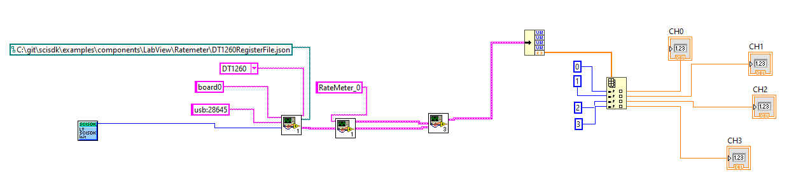

# Rate Meter

The rate meter is a simple component that allow to measure the rate of incoming signal
The integration time is configured by SciCompiler at Compile Time.
If the inegration time (configured in clock cycles) is multiple of clock period, the measure can be already considered in Hz, KHz, MHz ...
For example if clock frequency is 125MHz, and integration time is 125e6, the measure is in Hz, if integration time is 125e3, the measure is in KHz, if integration time is 125, the measure is in MHz.

This component support up to 256 channels.
The integration time is common to all channels.
The number in tha data field is the number of transition L->H of the i-th input signal in the integration time.


# Parameters
The following parameters can be configured:

| Parameter         | Acces Mode | Description                                                                              | Default value |
| ----------------- | ---------- | ---------------------------------------------------------------------------------------- | ------------- |
| buffer_type       | R          | type of the buffer: (SCISDK_RM_RAW_BUFFER)                                               |               |


## Commands
The are no commands for this component


## Output data Format

The ToF spectrum uses the same data structures of the energy spectrum
### Decoded Data
The data output structure is the following:

```c
	typedef struct {
		uint32_t magic;					
		double *data;					
		struct {
			uint32_t buffer_size;		
			uint32_t valid_data;		
			uint32_t nchannels;			
		}info;
	}SCISDK_RM_RAW_BUFFER;

```

The `magic` field is a 32 bit value that identify the data format.
The `data` field is a pointer to the data buffer. The data buffer is an array of 32 bit values. The number of elements in the array is defined by the `total_bins` field. The `valid_bins` field is the number of bins that contains data. The `valid_bins` field is always equal to `total_bins` field. 

Data in the `data` array are the rate of the i-th channel in the integration time.

| Data Format |
| ----------- |
| ch 0        |
| ch 1        |
| ch 2        |
| ...         |
| ch n        |


## Basic Examples
The following example shows how to use the Rate Meter component.

### C
```c

    SCISDK_RM_RAW_BUFFER *obRm;
    
    int res = SCISDK_AllocateBuffer("board0:/MMCComponents/RateMeter_0", T_BUFFER_TYPE_RAW, (void**)&obRm, _sdk);
    if (res != NI_OK) {
        printf("Error allocating buffer\n");
        return -1;
    }

    SCISDK_ReadData("board0:/MMCComponents/RateMeter_0", (void *)ob, _sdk);
    for (int i=0;i<ob->info.nchannels;i++) {
        printf("ch %d: %f\n", i, ob->data[i]);
    }
    ....

    SCISDK_FreeBuffer("board0:/MMCComponents/RateMeter_0", T_BUFFER_TYPE_RAW, (void**)&obRm, _sdk);

```

### C++
```c++
    SCISDK_RM_RAW_BUFFER *obRm;
    
    int res = sdk.AllocateBuffer("board0:/MMCComponents/RateMeter_0", T_BUFFER_TYPE_RAW, (void**)&obRm, _sdk);
    if (res != NI_OK) {
        cout << "Error allocating buffer" << endl;
        return -1;
    }

    sdk.ReadData("board0:/MMCComponents/RateMeter_0", (void *)obRm, _sdk);
    for (int i=0;i<obRm->info.nchannels;i++) {
        cout << "ch " << i << ": " << obRm->data[i] << endl;
    }
    
    ....

    sdk.FreeBuffer("board0:/MMCComponents/RateMeter_0", T_BUFFER_TYPE_RAW, (void**)&obRm, _sdk);

```

### Python
```python
    res, obSpectrum = sdk.AllocateBuffer("board0:/MMCComponents/RateMeter_0", 0)
    if res != 0:
        print("Error allocating buffer")
        return -1
   
    res, obRm = sdk.ReadData("board0:/MMCComponents/RateMeter_0", obRm)
    for i in range(obRm.info.nchannels):
        print("ch %d: %f" % (i, obRm.data[i]))

    ....

    sdk.FreeBuffer("board0:/MMCComponents/RateMeter_0", 0, obRm)

```

### C Sharp
```csharp
    SCISDK_RM_RAW_BUFFER obRm;
    
    int res = sdk.AllocateBuffer("board0:/MMCComponents/RateMeter_0", T_BUFFER_TYPE_RAW, ref obRm);
    if (res != 0) {
        Console.WriteLine("Error allocating buffer");
        return -1;
    }

    dk.ReadData("board0:/MMCComponents/RateMeter_0", ref obRm);
    for (int i=0;i<obRm.info.nchannels;i++) {
        Console.WriteLine("ch {0}: {1}", i, obRm.data[i]);
    }
    
    ....

    sdk.FreeBuffer("board0:/MMCComponents/RateMeter_0", T_BUFFER_TYPE_RAW, ref obRm);

```

### VB.NET
```vb
    Dim obRm As SCISDK_RM_RAW_BUFFER
    
    Dim res As Integer = sdk.AllocateBuffer("board0:/MMCComponents/RateMeter_0", T_BUFFER_TYPE_RAW, obRm)
    If res <> 0 Then
        Console.WriteLine("Error allocating buffer")
        Return -1
    End If

    sdk.ReadData("board0:/MMCComponents/RateMeter_0", obRm)
    For i As Integer = 0 To obRm.info.nchannels - 1
        Console.WriteLine("ch {0}: {1}", i, obRm.data(i))
    
    ....

    sdk.FreeBuffer("board0:/MMCComponents/RateMeter_0", T_BUFFER_TYPE_RAW, obRm)

```

### JAVA
```java
    // allocate buffer
    Ref<RMRawBuffer> buf = new Ref<>(new RMRawBuffer());
    int res = sdk.AllocateBuffer("board0:/MMCComponents/RateMeter_0", buf);
    if(res == 0) {
        res = sdk.ReadData("board0:/MMCComponents/RateMeter_0", buf);
        if (res == 0) {
            System.out.println("-------------------");
            for (int i = 0; i < buf.get().GetData().length; i++) {
                System.out.println(buf.get().GetData()[i]);
            }
        } else {
            Ref<String> error_description = new Ref<>("");
            sdk.s_error(res, error_description);
            System.out.println("ERROR DESCRIPTION: " + error_description.get());
        }
        res = sdk.FreeBuffer("board0:/MMCComponents/RateMeter_0", buf);
    }
```

### Labview



<i>You can find the labview file for this example [here](../examples/components/LabView/Ratemeter/Ratemeter.vi)</i>