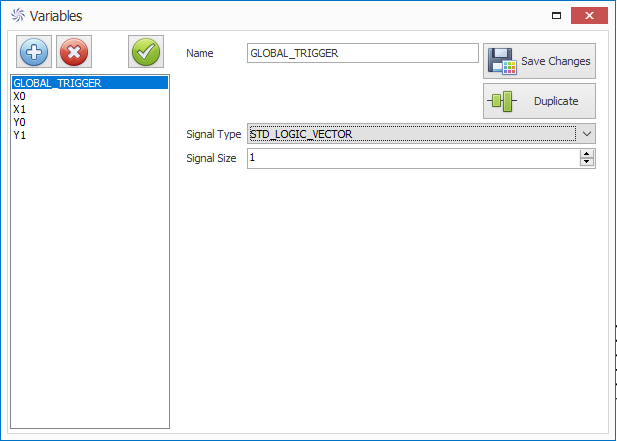
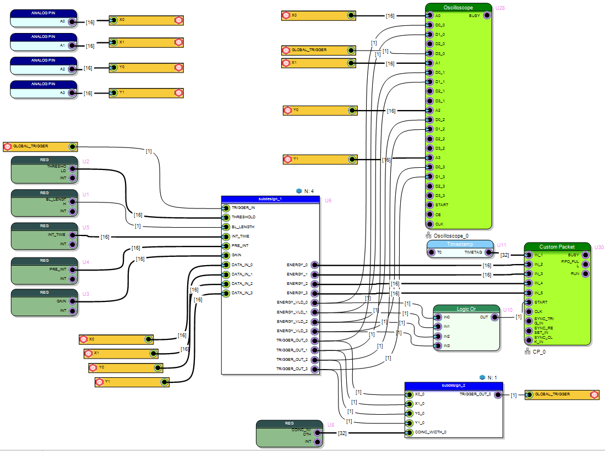
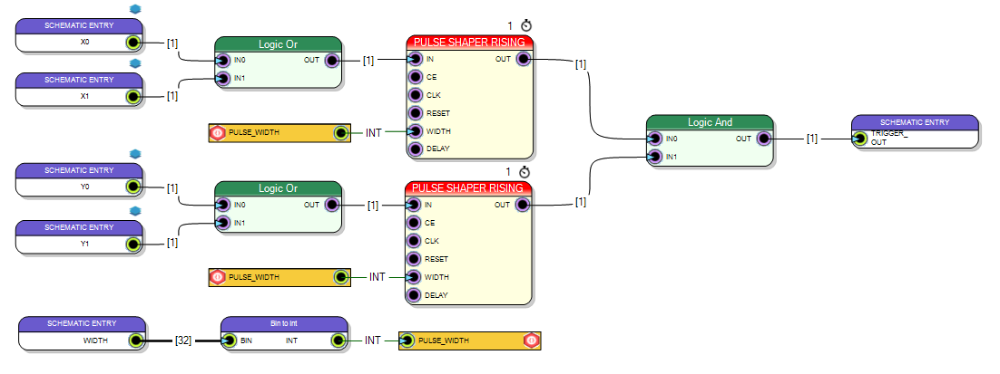

# Using SciCompiler and SciSDK to implement a coincidence trigger with charge integration; data are saved on a custom packet

The example shows how to implement a coincidence trigger. We are supposed to have a matrix of scintillator bars (two on the x-axis and two on the y-axis). The system automatically triggers if one of the x-axis bars and one of the y-axis bars are hit. The system also allows to calculate the energy of the hit bars. Every time there is the global trigger (one x and one y bars are hit) it calculates the energy of the signal. The data are saved in a custom packet and sent to the PC every time there is a "valid" energy. The system has also an oscilloscope that allows to see the signals of the bars.

## Experimental setup

## SciCompiler firmware

We use in particular these boxes:

### Pulse shaper rising
The **Pulse Shaper Rising** block generates an output pulse with programmable width and delay. When the block is created (Sequential Logic), it is possible to set the "no Delay Logic" (true or false) and the "clock edge" (rising or falling) in the property editor. The inputs are **IN** (input signal), **CLK** (clock signal), **Reset**, **Width** (pulse width), and **Delay** (pulse delay in respect of input signal). The output is **OUT** (output signal).

If the "no Delay Logic" is set to FALSE, the output signal is synchronous to the CLK clock edge specified in the property editor. If the "no Delay Logic" is set to TRUE, the output signal is synchronous to the input signal.

-------------------------------------------------------------------------------------
### Charge Integrator
The **Charge Int** block performs the charge integration of the input signal **IN**.

The inputs are also:
- **Trigger** signal indicates the presence of a signal whose area has to be measured, so it is used to start the integration process;
- **Int Time** value represents the time window to integrate, which has to be set properly to cover all the signal length;
- **Pre Int** value indicates how much time before the trigger the integration window has to start. This is necessary because the trigger could occur during the rise time of the signal;
- **Pile-up Inib** indicates the time interval during which the integration process is inhibited if another trigger occurs. This gate starts from the trigger and allows to discard of the events that occur during its length. In this way the area information will not be affected by an error;
- **Gain** indicates the digital gain that has to be applied to the resulting area;
- **Offset** indicates the offset to be added to the resulting area;
- **Baseline** indicates the baseline value to be subtracted from the total area.

The outputs are: **Energy**, **Energy VLD**, **INT**, **PILEUP** and **BUSY**.
- ENERGY is the result of the integration process, it is the area of the input signal;
- ENERGY VLD is a digital output that indicates when the integration process has produced a result;
- INT indicates the integration gate;
- PILEUP indicates when a pileup event occurred during the integration;
- BUSY indicates when the integration calculation is occurring.

-------------------------------------------------------------------------------------
### Baseline Restorer
The **Baseline Restorer** block calculates the baseline of the input signal **IN**. It is performed by averaging the signal values for a certain time interval. 

The baseline calculation starts when the input signal **Trigger** is HIGH. The **Length** input indicates the number of samples to be averaged, and the **Hold** input indicates the time interval for which the baseline is not calculated (for a correct baseline calculation the HOLD should be equal to the signal duration). 

The BASELINE outputs are **Baseline**, **Valid**, **Run/Hold**, and **Hold Time**.
- BASELINE is the baseline value signal;
- VALID indicates that a signal has been processed;
- RUN/HOLD is HIGH when the baseline calculation is occurring;
- HOLD TIME indicates the time in which the baseline is not calculated.

-------------------------------------------------------------------------------------
### Trigger LE
The **Trigger LE** block generates an output signal when the input signal amplitude exceeds a threshold. The threshold can be specified in the **Threshold** input. 

The output signals are **Delayed Data**, **Trigger**, and **TOT** (Time Over Threshold). 
- TRIGGER generates a signal every time an input signal exceeds the defined threshold;
- TOT stays HIGH for all the time that a trigger signal exceeds the threshold;
- DELAYED DATA is an analog output that reports the input signal with a delay.

-------------------------------------------------------------------------------------
### Custom Packet
The **Custom Packet** block allows transferring data from FPGA to the PC in list mode. It is a particular version of the "List" block, in which the user can define the format of the data. In the property editor, it is possible to set the "Number of samples per" with the size of the output FIFO. Clicking on the "Edit" button next to the packet layout it is possible to define the packet structure. To decode the custom packet it is recommended that the first word (32 bits). Each row of the custom packet is a 32 bits data word and it can be defined as constant, input, packet counter, time stamp, or packet length. Data will be sent to the PC from the FIFO as a line of words (in order). 

It also has the following inputs:
- **Start** indicates when the packet transmission has to start (inputs are latched all together);
- **CLK** is the clock signal;
- **Sync_Trig_In** is an external trigger signal that increments the trigger counter, even if the packet is not transferred;
- **Sync_Clk_In** in an external timestamp clock;
- **Sync_Reset_In** is an external reset signal that resets the trigger counter and the timestamp;

-------------------------------------------------------------------------------------

In this example, it is useful to divide the firmware into parts, using sub-designs. In this case, we use more than one channel and the functionalities of the different channels are identical. With **Sub design** it is possible to create a sub sheet that can be replicated several times in the top design.
We create two sub-designs, one for the charge integration and one with the trigger logic.

At first, we put four **Analog Input** boxes (A0, A1, A2, A3) in the main project. It is convenient to connect these boxes to the corresponding variables.

A variable can be created (Misc) as a vector or integer.

Press "+" button to generate a new variable, change the name, type and size; save changes. To connect the variable to the box, we create four **read** variables with the name of the coordinates (X0, X1, Y0, Y1). In this way, we can create **write** variables with the same name, that will output the value of the variable, and put them where it is necessary. The scheme will be more clear.

In the main project, we put also the registers, the oscilloscope, the Custom Packet and the sub-design blocks.

To create the sub-design blocks, we click on the **Sub-design** button and select "multi-channels sub-design". It is possible to choose the number of times to replicate, according to the number of channels. In this case, there are four channels as inputs of the **Charge_Integrator** block. This block also has other entries, that all channel share. These entries are connected to corresponding **Register Read** boxes: **Threshold**, **Bllength**, **Int_time**, **Pre_int** and **Gain**. It has also a Trigger_IN common input that is connected to a variable **Global_trigger**, which is the output of the **Trigger_logic** block. 

The outputs of the Charge_Integrator are the **Trigger_out**, the **Energy** and the **Energy_VLD** of each analog inputs.
-------------------------------------------------------------------------------------
### Charge_Integrator sub-design
In this sub-design, we create the firmware for the charge integration. We put the **Charge Integrator** block, the **Baseline Restorer** block, and the **Trigger LE** block. The main idea is to calculate the energy on each bar every time there is a signal on one of the bars in coincidence.

To calculate the integral, we get the input signal (one of the four) with a **schematic entry** block. In the sub-design, it is not possible to have registers or inputs, so we have to use this block. It is used to transfer a signal from an input port of a sub-design block in the main project file to the sub-design diagram file. The name, the type, and the size of the signal of the block should match the feature of the signal in the main diagram file. It is also possible to choose between **array** or **common**: in the first case the variable can be different and multiple, in the second case the variable is the same for all the multiple variables.

In this case, we create **Data_IN** block that is an array (it has a little symbol in the top right corner). It corresponds to the signal of one of the bars. When we generate the sub-design block on the main file, we select multiple channels block, so Data_IN corresponds to every variables.

Data_IN is the entrance of the **Trigger LE** block. The threshold input is connected to a schematic entry **Threshold**, that is a **common** variable. It is connected, in the main project to the register **Threshold**. This value will be the same for all the four input signals.

The signal to be integrated is given by the **Delayed Data** output. This is connected to the **Baseline Restorer** box and to the **Charge Integrator** box, both to the IN entrance. 

The **Trigger** output gives the trigger to Baseline box, to start the calculation of the baseline. It is also connected to a schematic entry (OUT) **Trigger_out**. On the **Charge Integrator** box, we will have four outputs corresponding to the for trigger of the signals. 

The Baseline box has also an other entry, **Length** that is connected to a schematic entry **Bllength**. This is a **common** variable, that has to be converted in an integer with a **Bin to int** box. It is connected int he main project to a register **Bllength**.

The output **Baseline** is connected to the baseline inputs of the **charge_int** block.

The charge_int block has inputs:
- **IN** that is connected to the **Delayed Data** output of the **Trigger LE** block;
- **Baseline** that is connected to the **Baseline** output of the **Baseline Restorer** block;
- **Int time** that is connected to a schematic entry **Int_time**. This is a **common** variable, that is connected in the main project to a register **Int_time**;
- **Pre_int** that is connected to a schematic entry **Pre_int**. This is a **common** variable, that is connected in the main project to a register **Pre_int**;
- **Gain** that is connected to a schematic entry **Gain**. This is a **common** variable, that is connected in the main project to a register **Gain**;
- **Trigger** that is connected to a schematic entry **Trigger_IN**, that is connected to the **Global_trigger** variable in the main file. Before entering in the charge int block it passes throw a **Edge detector (pos)**.

The Edge detector (pos) block detects the rising edge of the input signal and produce a pulse with a user defined width as a output signal. It generates an output signal with the user defined pulse width. In the **Pulse Width** it is possible to set the width of the pulse (Default value = 1). The output signal is HIGH in correspondence to the rising edge of the input signal and has a duration given by the pulse width. The input and the output are of equal size.

The outputs of the charge_int block are Energy and Energy VLD. They are connected to the **Energy** and **Energy VLD** schematic entry (OUT). In the sub-design block, they are multiple outputs.

-------------------------------------------------------------------------------------
The trigger_out outputs of the **Charge integrator** sub-design block are connected as inputs to the **Trigger_logic** sub-design block, each one to the corresponding input.

-------------------------------------------------------------------------------------
### Trigger_logic sub-design
In this sub-design, we create the firmware for generate a global trigger. There are four schematic entrance X0, X1, Y0, Y1, that are **array** variables. We put a **Logic Or** block between the x variables and another between the y variables. 

The output of the two **Logic Or** blocks are connected to the IN entrance of two **Pulse shaper rising** block. They both are generated setting the "no Delay Logic" to FALSE, and "clock edge" to RISING. 

With a schematic entry **Width** we set the width of the pulse. This is a **common** variable, that is connected in the main project to a register **Coinc_Width**. It is converted in an integer with a **Bin to int** box.

The output of the two Pulse shaper rising blocks are connected to a **Logic And** block. In this way, we have a trigger if one of the bars on the x-axis and one of the bars on the y-axis are hit. 

The output of this block is connected to a schematic entry (OUT) **Trigger_out**. In the main project, this output is connected to the **Global_trigger** variable, that is connected to the **Trigger_IN** input of the **Charge integrator** sub-design block.

-------------------------------------------------------------------------------------

The **Oscilloscope** as several entries:
- A0, A1, A2, A3 are connected to the X0, X1, Y0, Y1 variables.
- D3_0 is connected to the Global_trigger variable.
- D0_0, D0_1, D0_2, D0_3 are connected to the Energy VLD of the four bars.
- D1_0, D1_1, D1_2, D1_3 are connected to the Trigger_out of the four bars.

In the end, there is the **Custom Packet** block to save and read the data. In the property editor, we set the "Number of samples per" to 1024. In the editor of the packet layout, we set the packet structure. The Word_0 is a constant (FFFFFFFF), the Word_1 (32 bit) is a constant, the Word_2 and the Word_3 are "Input" of 16 bit coupled to occupy the 32 bit.   

The inputs are:
- **IN_1** is connected to a **Timestamp** block. This block generates a timestamp signal;
- **IN_2**, **IN_3**, **IN_4**, **IN_5** are connected to the **Energy** output of the four bars;
- **Start** is connected to a Logic Or block, that has as inputs the **Energy VLD** of the four bars. In this way, the packet is sent to the PC every time there is a "valid" energy.

## Readout data with Resource Explorer

## Readout data using SciSDK

### Python

### C#

### C++

