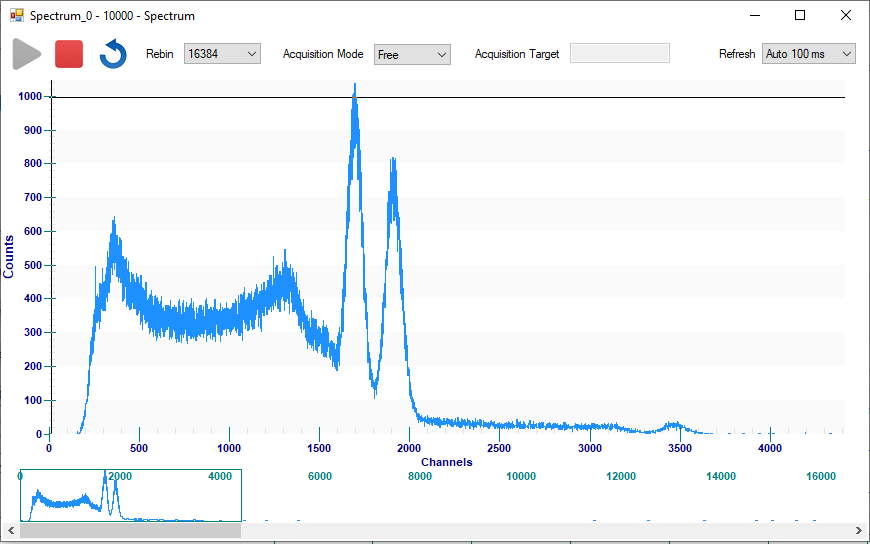

# Using SciCompiler and SciSDK to implement a charge integration writing a list and plotting a spectrum

## Experimental setup
We used the following setup to test the charge integration.

We use Cobalt60 as signal source and a Photomultiplier tube (PMT), to detect the gamma rays.

The PMT is connected to the SCI DK DT1260 board and the HV Power Supply Module.

It is connected to the digitizer DT1260 to channel 1 with a LEMO cable .
It is connected to the HV Module, the DT5533E, to channel 1 with a BNC cable.

Both the modules are also connected to the computer. The digitizer is connected with a micro USB cable. The HV Module is connected with a USB type B cable.

## SciCompiler firmware
We use in particular these boxes:
### Trigger LE
The **Trigger LE** block generates an output signal when the input signal amplitude exceeds a threshold. The threshold can be specified in the **Treshold** entrance. 

The output signals are **Delayed Data**, **Trigger** and **TOT** (Time Over Threshold). 
- the Trigger output generates a signal every time an input signal exceeding the defined threshold (size 1);
- the TOT output stays HIGH for all the time that a trigger signal exceeds the threshold (size 1);
- the analog Delayed Data output reports the input signal with a delay (size 1..32).

-------------------------------------------------------------------------------------
### Charge Integrator
The **Charge Int** block performs the charge integration of the input signal IN.

The inputs are:
- **Trigger** input indicates the presence of a signal whose area has to be measured, so it is used to start the integration process;
- **Int Time** represents the time window for the signal integration, that has to be set properly in order to cover all the signal length;
- **Pre Int** input indicates how much time before the trigger signal the integration window has to start. This is necessary because the trigger could occur during the rise time of the signal to be studied. In this way all the signal will be integrated;
- **Pile-up Inib** input indicates the time interval during which the integration process is inhibited if another trigger occurs. This gate starts from the trigger signal and allows to discard the events occurs during its length. In this way the area information will not be affected by an error;
- **Gain** input indicates the factor of digital gain that has to be applied to the resulting signal area;
- **Offset** input indicates the offset to be added to the resulting signal area;
- **Baseline** input indicates the baseline value to be subtracted to the total signal area.

The outputs are: **Energy**, **Energy VLD**, **INT**, **PILEUP** and **BUSY**.
- ENERGY is the result of the integration process, is the area of the input signal;
- ENERGY VLD is a digital output that indicates when the integration process has produced a result;
- INT indicates the integration gate;
- PILEUP indicates when a pileup event occurred during the integration;
- BUSY indicates when the integration calculation is occurring.

-------------------------------------------------------------------------------------
### Baseline Restorer
The **Baseline Restorer** block performs the baseline calculation of the input signal IN. The baseline is calculated by averaging the signal values for a certain amount of time. 

The baseline calculation starts when the input signal TRIGGER is HIGH.
The LENGTH input signal indicates the number of samples to be averaged, while the HOLD input signal indicates the time interval for which the baseline is not calculated (for a correct baseline calculation the HOLD should be equal to the signal duration). 

The BASELINE outputs are **Baseline**, **Valid**, **Run/Hold** and **Hold Time**.
- BASELINE is the signal contains the signal baseline value;
- VALID output indicates that a signal has been processed;
- RUN/HOLD output is HIGH when the baseline calculation is occurring;
- HOLD TIME output indicates the time in which the baseline is not calculated.  

-------------------------------------------------------------------------------------

The example shows how to integrate the analog input signal to measure its energy.

At first, we put an **Analog Input** box and select A0 as the analog signal input. It is connected to a **Polarity Inverter** box (input bins: 16, effective # bins: 12): the signal of the PMT has a negative polarity so we invert it, because it is easier to work with positive signals. We add a **Register Read** box (**pol**) to set the inversion.

The output signal of the polarity inverter is connected to the **Oscilloscope** box, to an analog entrance (A0), and to the **Trigger LE** box, to the In entrance.

To set the threshold of the trigger, we put a **Register Read** box (**trgthrs**).

The signal to be integrated is given by the **Delayed Data** output. This is connected to the **Baseline Restorer** box and to the **Charge Integrator** box, both to the IN entrance. 
This output is also connected to the **Oscilloscope** box, to an analog entrance (A2).

The **Trigger** output gives the trigger to both Baseline box and Charge integrator box, to start the process. It is also connected to the Oscilloscope box tho a digital entrance (D0_2) and to **Start** entrance to give the external trigger to the Oscilloscope.

The baseline is calculated for a number of samples giving by the **Register Read** box (**Nsamples**). The time window for which the baseline is not calculated (**Hold**) is given by the **Register Read** box (**time_hold_bs**).

The baseline value is provided to the Charge Integrator box to be subtracted to the signal area (to the **Baseline** entrance), and to the Oscilloscope box to be displayed (to the analog entrance A1).
Also the **Valid** and the **Run/Hold** outputs are connected to the Oscilloscope to the digital entrance D0_1 and D1_1, to see if the signal is processed and when the baseline calculation is occurring.

The Charge integration is performed when the trigger signal arrived. To set all the parameters of the integration, we use some **Register Read** boxes: **time_integr**, to set the integration interval, **pre_integr**, to set the pre-integration gate, **gain** and **Offset_int**. The pileup rejection time is by default 0.

The resulting value **Energy** is connected to the Oscilloscope box to the analog entrance (A3), to a **Spectrum** box and to a **List** box.

Also the output **Energy VLD**, **INT** and **PILEUP** are connected to the Oscilloscope box to the digital entrances D0_3, D1_3 and D2_3.

The **Spectrum** block calculates the histogram of the input values and stored it in the internal memory. This box receives the **Energy** signal and the **Energy VLD** signal. The **Energy VLD** signal enables the data writing.

The **List** box represents a list of data that could be buffered and downloaded with the specific **List Module tool** in the Resource Explorer. It receives the **Energy** signal as input.

## Readout data with Resource Explorer
Opening **Resource Explorer**, it is possible to view the oscilloscope, to set the parameters of the registers, to download the data from the List and to see the spectrum of the data.

We set the polarity (pol) as 1, to invert the signal.
We set the threshold of the trigger (trgthrs) al 2000, to see an effect on the signal. We set the trigger sources of the oscilloscope to **External**, so we get the same trigger as the Trigger LE box.

We set the number of samples for the baseline calculation (Nsamples) as 7. This parameter is the exponent of 2, so the number of samples is 2^7 = 128.
We set the time for which the baseline is not calculated (time_hold_bs) as 100, to exclude all the signal from the calculation.

We set the integration time (time_integr) as 76, to integrate the signal for 76 samples.
we set the pre-integration time (pre_integr) as 5, to start the integration 5 samples before the trigger.
we set the gain (gain) as 10000 and the offset (offset) as 0, to have the signal area in ADC counts.

To see the histogram of the data, we click on the **Acquire** button and the following window will be shown.

It is possible to set the **Rebin** factor (16384), as the number of channel to be used. The acquisition mode can be set as Free, Counts end Time. In the field **Refrech** it is possible to set the refresh rate of the spectrum.
The spectrum can than be read as a standard memory and each bin is represented by a word.

To get the data from the List, we click on the **Download** button and the following window will be shown.

In this tool, it is possible to select the **Format** in which the data will be downloaded (decimal or binary). 
The fields **File Name** and **File Folder** allow to specify the name and the path of the file downloaded.

The number of data in words is specified in the **Target Size** field. It is possible to set the unit from the menu on its right side (word, kW, MW). In the **Packet Size** field it is possible to set the number of words.

The download process can be started and stopped with, respectively, the **Start** and **Stop** buttons.

In the chosen directory, a file ".txt" will be created with the data.

## Readout data using SciSDK
It is possible to read and to plot the data using the following code.

Python
counter_list_readout.py contains the code to set the registers and to read and to plot the data from the counter value list.

These is the possibility to print a single value of the data in the list, and an array of sequential values.

In the end is possible to plot in an interactive window.

C++
### Python
In the Python directory there are the following directories:

- **Read_spectrum**: it contains a code to read the spectrum data. Set the registers and the spectrum parameters. It waits for the acquisition to get some data (50s). Then it reads the data and save the spectrum data in a file *spectrum_read.txt* with two columns: the first one is the channel number and the second one is the number of counts.
  
- **Read_list**: it contains a code to read the list data. Set the registers and the list parameters. It allocates the list buffer. Then it reads the data  of the list and save them in a file *list.txt* with two columns: the first one is the progressive number, from 0 to *info.valid_samples/4*, and the second one is the number in the list. 
  
- **Plot_chargeintegration**: it contains the following files:
  - **Plot_spectrum.py**: it contains the code to set the registers and the spectrum parameters. With *matplotlib*, it is possible to plot the spectrum. In the window it is possible to start, stop and restart the acquisition; and also to set the parameters of the registers.
  - **Plot_spectrum_PyQt.py**: it is the same of Pot_spectrum.py but with *PyQt5*.
  - **Plot_oscilloscope.py**: it contains the code to set the registers and the oscilloscope parameters. With *matplotlib*, it is possible to plot the oscilloscope. In the window it is possible to start and stop the acquisition; and also to set the parameters of the registers. With a checkbox it is possible to set which chanel is plotted. Every channel has an analog signal and some digital signals.
  - **Plot_spectrum_oscilloscope.py**: it is a combination of the three previous files: with *PyQt5*, it is possible to plot the spectrum and the oscilloscope in the same window; start, stop and reset the acquisition; set the parameters of the registers; and choose which channel to plot in the oscilloscope.

### C#
In the C# directory there are the following directories:

- **Read_spectrum**: it contains a code to read the spectrum data. Set the registers and the spectrum parameters. It waits for the acquisition to get some data (50s). Then it reads the data and save the spectrum data in a file *spectrum_read.txt* with two columns: the first one is the channel number and the second one is the number of counts.

### C++

