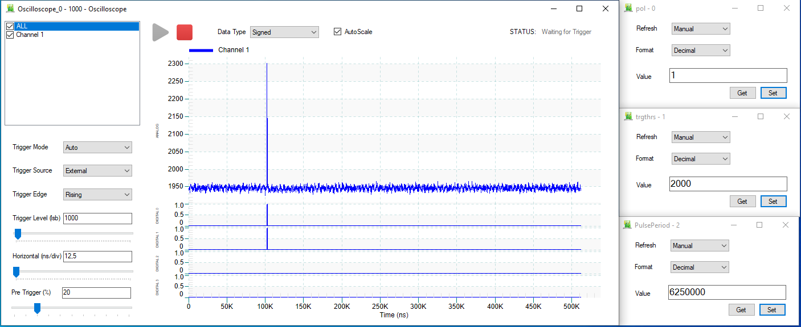

# Using SciCompiler and SciSDK to implement a pulse counter reading a list

## Experimental setup
We used the following setup to test the counter reading a list.

We use Cobalt60 as signal source and a Photomultiplier tube (PMT), to detect the gamma rays.

The PMT is connected to the SCI DK DT1260 board and the HV Power Supply Module.

It is connected to the digitizer DT1260 to channel 1 with a LEMO cable .
It is connected to the HV Module, the DT5533E, to channel 1 with a BNC cable.

Both the modules are also connected to the computer. The digitizer is connected with a micro USB cable. The HV Module is connected with a USB type B cable.

## SciCompiler firmware
At first, we put an **Analog Input** box and select A0 as the analog signal input.

Before connecting the input signal to the oscilloscope, we put a **Polarity Inverter** box. The signal has a negative polarity so we invert it, because it is easier to work with positive signals. We also add a **Register Read** box (**pol**) to set the inversion.

The output signal of the polarity inverter is connected to the **Oscilloscope** box, to the analog entrance (A0).

After the polarity inverter, we put a **Trigger LE** box. The input signal is given in the In entrance. This box generates an output signal when the input signal amplitude exceeds a threshold. The threshold is specified with a **Register Read** box (**trgthrs**). The output signal **TOT** (Time Over Threshold) gives the triggered signal and it is connected to the **Oscilloscope** to a digital input (D1_0).

The **Trigger** output generates a signal every time a input signal exceeds the threshold. This output is connected to the Oscilloscope to a digital input (D0_0) and to the **Start** input to give an external trigger to the Oscilloscope.

The Trigger output is also connected to a **Couter** box, to the In entrance. The block counts the input pulses occurring during a certain period of time. The output signal is connected to a **List** box, to the In entrance.

The **List** block represent a list of data that could be buffered and downloaded with the specific **List Module tool** in the Resource Explorer.

To reset the Counter and the writing input of the List box, we put a **Pulse Generator** box. This box generates a periodic pulse. The pulse period and the width can be programmed. We put a **Register Read** box (**PulsePeriod**) to set the period, the width is in default set.

The output signal of the Pulse Generator is connected directly to the **WE** input of the List. In this way, every time there is a pulse, it enables the data writing.

The output signal of the Pulse Generator is also connected to the **Reset** input of the Counter, but first it passes through a **D-Latch Rising** box.

A D-Latch has a data input signal (D) and a control entry (Clock). When the Clock is HIGH (1), the input data is reported to the output and memorized in the circuit. When the Clock is LOW (0), the output is not changed and keeps the previous value, independently from the input signal changes.

In this case, the input signal is the pulse, the Clock is set to Default value: CLK_ACQ for DT5550 (80 MHz) and CLK_50 for V2495 (50 MHz), and the output goes to the Reset of the Counter.

## Readout data with Resource Explorer
Opening **Resource Explorer**, it is possible to view the oscilloscope, to set the parameters of the registers and to download the data from the List.

We set the polarity (pol) as 1, to invert the signal.

We set the threshold of the trigger (trgthrs) al 2000, to see an effect on 
the signal.

We set the period of the pulse generator (PulsePeriod) as 6250000. CLock of the board is 62.5 MHz, so the period is 6250000/62.5e6 = 100 ms.

In the end, we set the trigger sources of the oscilloscope to **External**,
so we get the same trigger signal as the one used by the Trigger LE.

To get the data from the List, we click on the **Download** button and the following window will be shown.

In this tool, it is possible to select the **Format** in which the data will be downloaded (decimal or binary). The fields **File Name** and **File Folder** allow to specify the name and the path of the file downloaded.

The number of data in words is specified in the **Target Size** field. It 
is possible to set the unit from the menu on its right side (word, kW, MW). 
In the **Packet Size** field it is possible to set the number of words.

The download process can be started and stopped with, respectively, the 
**Start** and **Stop** buttons.

In the chosen directory, a file ".txt" will be created with the data.

## Readout data using SciSDK
It is possible to read and to plot the data using the following code.

### Python
counter_list_readout.py contains the code to set the registers and to read and to plot the data from the counter value list.

These is the possibility to print a  single value of the data in the list, and an array of sequential values.

In the end is possible to plot in an interactive window.
### C++

### C#