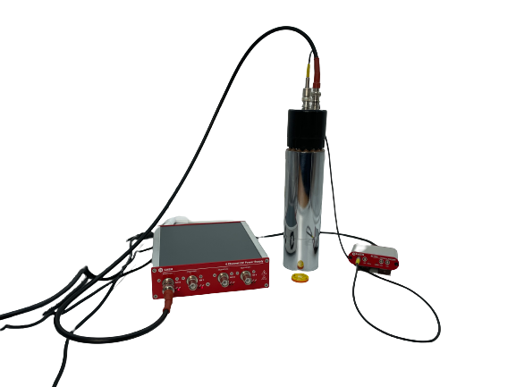

# Using SciCompiler and SciSDK to implement a pulse counter with leading edge trigger

## Experimental setup
We used the following setup to test the pulse counter.

We use Cobalt60 as signal source and a Photomultiplier tube (PMT), to detect the gamma rays.

The PMT is connected to the SCI DK DT1260 board and the HV Power Supply Module.

It is connected to the digitizer DT1260 to channel 1 with a LEMO cable . 
It is connected to the HV Module, the DT5533E, to channel 1 with a BNC cable.

Both the modules are also connected to the computer. The digitizer is connected with a micro USB cable. The HV Module is connected with a USB type B cable.

## SciCompiler firmware
At first, we put an **Analog Input** box and select A0 as the analog signal input.

Before connecting the input signal to the oscilloscope, we put a **Polarity Inverter** box. The signal has negative polarity but it easier to work with positive signals, so we invert the polarity. We add a **Register Read** box (**pol**) and connect it to the Inverter, to set the inversion.

The signal then go to the **Oscilloscope** box, to the analog entrance (A0).

After the polarity inverter, we put a **Trigger LE** box. It is a leading edge trigger: it generates an output signal when the input signal amplitude exceeds a threshold. The input analog signal is given in the In input, where we connect the output signal of polarity inverter. The threshold is specified in the Threshold input signal. To set the trigger level, we add a **Register Read** box (**trgthrs**).

The Trigger LE box has a Trigger output and a Time Over Threshold output. 
The TOT output gives the triggered signal and it is connected to the **Oscilloscope** to a digital input (D1_0).
The Trigger output is connected to a **Counter** box and to the oscilloscope to a digital input (D0_0). This output generates a signal in correspondence of an input signal exceeding the defined threshold.

The counter box counts the number of trigger detected. It is possible to read the counted pulses with the **Register Write** box (**trgcnt**), connected to the Count output.

The trigger output is also connected to the START input of the oscilloscope. This input represents an external trigger. In this way, the oscilloscope starts to acquire data when the trigger is detected.

We compile the firmware and download it to the DT1260 board.

## Readout data with Resource Explorer
Opening **Resource Explorer**, it is possible to view the oscilloscope and to set the parameters of the register boxes.

We set the polarity (pol) as 1, to invert the signal.

We set the threshold of the trigger (trgthrs) al 2400, to see an effect on the signal.

We set the counter (trgcnt) in Auto Refresh mode, to see the counter value changing.

In the end, we set the trigger sources of the oscilloscope to **External**, so we get the same trigger signal as the one used by the Trigger LE.

## Readout data using SciSDK
It is possible to read and plot the data using the following code.
### Python
Register_setup.py contains the code to set the registers and to read and to plot the counter value.
There is the possibility to read a single value or read the counter value in a loop, as a vector.
It is also possible to plot the data with matplotlib with animation.
In the plot window, it is possible to start, stop and reset the counter.

### C++
In ConsoleRegisterRead.sln there is a C++ project to read the counter value.
It is possible to read a single value or read the counter value in a loop, as a vector.
It is also possible to keep the console open, so after 100 counts, decide to stop the counter (q key) or to keep counting (any other key).

### C#
#### ConsoleRegisterRead
In ConsoleRegisterRead.sln there is a C# project to read the counter value.
It is possible to read a single value or read the counter value in a loop, as a vector.
It is also possible to keep the console open after 100 counts, so decide to stop the counter (q
key) or to keep counting (any other key).

#### RegisterReadPlot
In RegisterReadPlot.sln there is a C# project to read the counter value and to plot it with the help of the OxyPlot library. In the plot window, it is possible to start, stop and reset the counter.

